## 요약

 프로젝트 요약 및 발표자료: [Link](https://drive.google.com/drive/folders/1jEQFdcqzLyA1emQ4sV15j71mdYQqZgIx?usp=sharing)


## Kaggle_user 정보를 통해 투표수와 메달 예측 


```python
from keras.layers import Input, Dense
from keras.models import Model, Sequential
from keras import regularizers
from sklearn.model_selection import train_test_split 
from sklearn.linear_model import LogisticRegression
from sklearn.metrics import classification_report, accuracy_score
from sklearn.manifold import TSNE
from sklearn import preprocessing 
import matplotlib.pyplot as plt
import pandas as pd 
import numpy as np
import seaborn as sns
from datetime import datetime
from sklearn.preprocessing import StandardScaler
import pytz
```


```python
data = pd.read_excel('kaggle_datasets.xlsx')
data
```


<div>
<style scoped>
    .dataframe tbody tr th:only-of-type {
        vertical-align: middle;
    }


    .dataframe tbody tr th {
        vertical-align: top;
    }
    
    .dataframe thead th {
        text-align: right;
    }

</style>

<table border="1" class="dataframe">
  <thead>
    <tr style="text-align: right;">
      <th></th>
      <th>rank</th>
      <th>datasetUrl</th>
      <th>ownerUrl</th>
      <th>creatorUrl</th>
      <th>scriptCount</th>
      <th>viewCount</th>
      <th>downloadCount</th>
      <th>dateCreated</th>
      <th>dateUpdated</th>
      <th>datasetSize</th>
      <th>totalVotes</th>
      <th>datasetId</th>
      <th>categories</th>
      <th>tags</th>
      <th>usabilityRating</th>
      <th>medal</th>
    </tr>
  </thead>
  <tbody>
    <tr>
      <th>0</th>
      <td>1</td>
      <td>/datasets/jessicali9530/animal-crossing-new-ho...</td>
      <td>/jessicali9530</td>
      <td>/jessicali9530</td>
      <td>26.0</td>
      <td>455383</td>
      <td>36830.0</td>
      <td>2020-05-18T22:50:26.640Z</td>
      <td>2021-06-08T15:05:09.513Z</td>
      <td>5.907700e+05</td>
      <td>29208</td>
      <td>661950</td>
      <td>16151</td>
      <td>/tags/simulation-games</td>
      <td>0.823529</td>
      <td>gold</td>
    </tr>
    <tr>
      <th>1</th>
      <td>2</td>
      <td>/datasets/allen-institute-for-ai/CORD-19-resea...</td>
      <td>/allen-institute-for-ai</td>
      <td>/paultimothymooney</td>
      <td>1695.0</td>
      <td>4327230</td>
      <td>157597.0</td>
      <td>2020-03-12T20:05:08.200Z</td>
      <td>2022-06-06T19:39:40.923Z</td>
      <td>1.972498e+10</td>
      <td>10328</td>
      <td>551982</td>
      <td>4309|7100|11102|12107|13204|16575</td>
      <td>/tags/public-health|/tags/biology|/tags/busine...</td>
      <td>0.882353</td>
      <td>gold</td>
    </tr>
    <tr>
      <th>2</th>
      <td>3</td>
      <td>/datasets/mlg-ulb/creditcardfraud</td>
      <td>/mlg-ulb</td>
      <td>/timoboz</td>
      <td>4035.0</td>
      <td>9878695</td>
      <td>500554.0</td>
      <td>2016-11-03T13:21:36.757Z</td>
      <td>2018-03-23T01:17:27.913Z</td>
      <td>6.915567e+07</td>
      <td>9897</td>
      <td>310</td>
      <td>11104|11108</td>
      <td>/tags/crime|/tags/finance</td>
      <td>0.852941</td>
      <td>gold</td>
    </tr>
    <tr>
      <th>3</th>
      <td>4</td>
      <td>/datasets/shivamb/netflix-shows</td>
      <td>/shivamb</td>
      <td>/shivamb</td>
      <td>1231.0</td>
      <td>2185984</td>
      <td>317287.0</td>
      <td>2019-12-04T05:57:54.557Z</td>
      <td>2021-09-27T04:44:36.770Z</td>
      <td>1.400865e+06</td>
      <td>7307</td>
      <td>434238</td>
      <td>1115|2200|2303|13201|13208</td>
      <td>/tags/web-sites|/tags/arts-and-entertainment|/...</td>
      <td>1.000000</td>
      <td>gold</td>
    </tr>
    <tr>
      <th>4</th>
      <td>5</td>
      <td>/datasets/sudalairajkumar/novel-corona-virus-2...</td>
      <td>/sudalairajkumar</td>
      <td>/sudalairajkumar</td>
      <td>1623.0</td>
      <td>2343233</td>
      <td>399665.0</td>
      <td>2020-01-30T14:18:33.640Z</td>
      <td>2021-06-24T04:27:25.870Z</td>
      <td>8.928752e+06</td>
      <td>5954</td>
      <td>494724</td>
      <td>4309|11111|11115|16378|16575</td>
      <td>/tags/public-health|/tags/health|/tags/law|/ta...</td>
      <td>0.970588</td>
      <td>gold</td>
    </tr>
    <tr>
      <th>...</th>
      <td>...</td>
      <td>...</td>
      <td>...</td>
      <td>...</td>
      <td>...</td>
      <td>...</td>
      <td>...</td>
      <td>...</td>
      <td>...</td>
      <td>...</td>
      <td>...</td>
      <td>...</td>
      <td>...</td>
      <td>...</td>
      <td>...</td>
      <td>...</td>
    </tr>
    <tr>
      <th>9987</th>
      <td>9996</td>
      <td>/datasets/mpwolke/cusersmarildownloadsseniorcsv</td>
      <td>/mpwolke</td>
      <td>/mpwolke</td>
      <td>1.0</td>
      <td>1713</td>
      <td>93.0</td>
      <td>2022-09-16T14:00:40.123Z</td>
      <td>2022-09-16T14:00:40.123Z</td>
      <td>2.489340e+05</td>
      <td>21</td>
      <td>2483308</td>
      <td>4171|11111|14101</td>
      <td>/tags/mental-health|/tags/health|/tags/tabular...</td>
      <td>1.000000</td>
      <td>bronze</td>
    </tr>
    <tr>
      <th>9988</th>
      <td>9997</td>
      <td>/datasets/sagarvarandekar/macroeconomic-factor...</td>
      <td>/sagarvarandekar</td>
      <td>/sagarvarandekar</td>
      <td>4.0</td>
      <td>5476</td>
      <td>804.0</td>
      <td>2022-09-09T06:16:53.267Z</td>
      <td>2022-09-09T06:16:53.267Z</td>
      <td>1.000800e+04</td>
      <td>21</td>
      <td>2466336</td>
      <td>11200|11205</td>
      <td>/tags/social-sciences|/tags/economics</td>
      <td>0.852941</td>
      <td>bronze</td>
    </tr>
    <tr>
      <th>9989</th>
      <td>9998</td>
      <td>/datasets/luiaalvarez/chapter-i-data-science-b...</td>
      <td>/luiaalvarez</td>
      <td>/luiaalvarez</td>
      <td>1.0</td>
      <td>1477</td>
      <td>108.0</td>
      <td>2022-09-18T11:38:11.313Z</td>
      <td>2022-09-18T11:38:11.313Z</td>
      <td>4.136100e+04</td>
      <td>21</td>
      <td>2486992</td>
      <td>11102|13102|13205|13215|14104</td>
      <td>/tags/business|/tags/beginner|/tags/text-minin...</td>
      <td>1.000000</td>
      <td>bronze</td>
    </tr>
    <tr>
      <th>9990</th>
      <td>9999</td>
      <td>/datasets/serkanp/cardio-fitness</td>
      <td>/serkanp</td>
      <td>/serkanp</td>
      <td>1.0</td>
      <td>302</td>
      <td>26.0</td>
      <td>2022-09-23T16:51:22.507Z</td>
      <td>2022-09-23T16:51:22.507Z</td>
      <td>1.701000e+03</td>
      <td>21</td>
      <td>2499900</td>
      <td>4130</td>
      <td>/tags/exercise</td>
      <td>0.294118</td>
      <td>bronze</td>
    </tr>
    <tr>
      <th>9991</th>
      <td>10000</td>
      <td>/datasets/mafhhdeveolper/student-data</td>
      <td>/mafhhdeveolper</td>
      <td>/mafhhdeveolper</td>
      <td>3.0</td>
      <td>407</td>
      <td>31.0</td>
      <td>2022-09-23T18:26:01.393Z</td>
      <td>2022-09-23T18:26:01.393Z</td>
      <td>3.010000e+02</td>
      <td>21</td>
      <td>2500012</td>
      <td>1222</td>
      <td>/tags/universities-and-colleges</td>
      <td>0.294118</td>
      <td>bronze</td>
    </tr>
  </tbody>
</table>
<p>9992 rows × 16 columns</p>

</div>


```python
data.isnull().sum()
```


    rank                  0
    datasetUrl            0
    ownerUrl              0
    creatorUrl            0
    scriptCount         924
    viewCount             0
    downloadCount        61
    dateCreated           0
    dateUpdated           0
    datasetSize          58
    totalVotes            0
    datasetId             0
    categories          587
    tags                587
    usabilityRating      10
    medal              1038
    dtype: int64


```python
# downloadCount, scriptCount,  0으로 간주 
# medal은 총 4개의 label로 분류 
# datasetSize, categories, tags  없애기 
```


```python
data.describe()
```


<div>
<style scoped>
    .dataframe tbody tr th:only-of-type {
        vertical-align: middle;
    }


    .dataframe tbody tr th {
        vertical-align: top;
    }
    
    .dataframe thead th {
        text-align: right;
    }

</style>

<table border="1" class="dataframe">
  <thead>
    <tr style="text-align: right;">
      <th></th>
      <th>rank</th>
      <th>scriptCount</th>
      <th>viewCount</th>
      <th>downloadCount</th>
      <th>datasetSize</th>
      <th>totalVotes</th>
      <th>datasetId</th>
      <th>usabilityRating</th>
    </tr>
  </thead>
  <tbody>
    <tr>
      <th>count</th>
      <td>9992.000000</td>
      <td>9068.000000</td>
      <td>9.992000e+03</td>
      <td>9931.000000</td>
      <td>9.934000e+03</td>
      <td>9992.000000</td>
      <td>9.992000e+03</td>
      <td>9982.000000</td>
    </tr>
    <tr>
      <th>mean</th>
      <td>5001.074860</td>
      <td>31.351897</td>
      <td>3.475381e+04</td>
      <td>4507.067466</td>
      <td>7.547349e+08</td>
      <td>97.393114</td>
      <td>1.171451e+06</td>
      <td>0.816203</td>
    </tr>
    <tr>
      <th>std</th>
      <td>2886.393495</td>
      <td>165.063914</td>
      <td>1.459961e+05</td>
      <td>16632.699359</td>
      <td>5.565521e+09</td>
      <td>417.681414</td>
      <td>9.666961e+05</td>
      <td>0.212895</td>
    </tr>
    <tr>
      <th>min</th>
      <td>1.000000</td>
      <td>1.000000</td>
      <td>1.800000e+01</td>
      <td>1.000000</td>
      <td>0.000000e+00</td>
      <td>21.000000</td>
      <td>6.000000e+00</td>
      <td>0.058824</td>
    </tr>
    <tr>
      <th>25%</th>
      <td>2501.750000</td>
      <td>2.000000</td>
      <td>4.663750e+03</td>
      <td>510.500000</td>
      <td>4.797000e+04</td>
      <td>28.000000</td>
      <td>1.415912e+05</td>
      <td>0.705882</td>
    </tr>
    <tr>
      <th>50%</th>
      <td>5002.500000</td>
      <td>5.000000</td>
      <td>1.105650e+04</td>
      <td>1192.000000</td>
      <td>1.185584e+06</td>
      <td>37.000000</td>
      <td>1.015275e+06</td>
      <td>0.875000</td>
    </tr>
    <tr>
      <th>75%</th>
      <td>7500.250000</td>
      <td>15.000000</td>
      <td>2.591125e+04</td>
      <td>3006.500000</td>
      <td>5.352588e+07</td>
      <td>65.000000</td>
      <td>2.072126e+06</td>
      <td>1.000000</td>
    </tr>
    <tr>
      <th>max</th>
      <td>10000.000000</td>
      <td>6177.000000</td>
      <td>9.878695e+06</td>
      <td>500554.000000</td>
      <td>3.977035e+11</td>
      <td>29208.000000</td>
      <td>2.983664e+06</td>
      <td>1.000000</td>
    </tr>
  </tbody>
</table>

</div>


```python
data['categories']
```


    0                                   16151
    1       4309|7100|11102|12107|13204|16575
    2                             11104|11108
    3              1115|2200|2303|13201|13208
    4            4309|11111|11115|16378|16575
                          ...                
    9987                     4171|11111|14101
    9988                          11200|11205
    9989        11102|13102|13205|13215|14104
    9990                                 4130
    9991                                 1222
    Name: categories, Length: 9992, dtype: object


```python
data['tags']
```


    0                                  /tags/simulation-games
    1       /tags/public-health|/tags/biology|/tags/busine...
    2                               /tags/crime|/tags/finance
    3       /tags/web-sites|/tags/arts-and-entertainment|/...
    4       /tags/public-health|/tags/health|/tags/law|/ta...
                                  ...                        
    9987    /tags/mental-health|/tags/health|/tags/tabular...
    9988                /tags/social-sciences|/tags/economics
    9989    /tags/business|/tags/beginner|/tags/text-minin...
    9990                                       /tags/exercise
    9991                      /tags/universities-and-colleges
    Name: tags, Length: 9992, dtype: object


```python
data.columns
```


    Index(['rank', 'datasetUrl', 'ownerUrl', 'creatorUrl', 'scriptCount',
           'viewCount', 'downloadCount', 'dateCreated', 'dateUpdated',
           'datasetSize', 'totalVotes', 'datasetId', 'categories', 'tags',
           'usabilityRating', 'medal'],
          dtype='object')


```python
data.info()
```

    <class 'pandas.core.frame.DataFrame'>
    RangeIndex: 9992 entries, 0 to 9991
    Data columns (total 16 columns):
     #   Column           Non-Null Count  Dtype  
    ---  ------           --------------  -----  
     0   rank             9992 non-null   int64  
     1   datasetUrl       9992 non-null   object 
     2   ownerUrl         9992 non-null   object 
     3   creatorUrl       9992 non-null   object 
     4   scriptCount      9068 non-null   float64
     5   viewCount        9992 non-null   int64  
     6   downloadCount    9931 non-null   float64
     7   dateCreated      9992 non-null   object 
     8   dateUpdated      9992 non-null   object 
     9   datasetSize      9934 non-null   float64
     10  totalVotes       9992 non-null   int64  
     11  datasetId        9992 non-null   int64  
     12  categories       9405 non-null   object 
     13  tags             9405 non-null   object 
     14  usabilityRating  9982 non-null   float64
     15  medal            8954 non-null   object 
    dtypes: float64(4), int64(4), object(8)
    memory usage: 1.2+ MB


## EDA


```python
data['medal'].value_counts()
```


    bronze    5887
    silver    2233
    gold       834
    Name: medal, dtype: int64


```python
data['scriptCount'] = data['scriptCount'].fillna(0)
data['downloadCount'] = data['downloadCount'].fillna(0)
```


```python
# medal은 총 4개의 label로 분류 
data['medal'] = data['medal'].fillna('no_model')
```


```python
# most of ownerUrl and creatorUrl are similar
(data['ownerUrl'] == data['creatorUrl']).sum()/9992
```


    0.9276421136909527


```python
data.loc[data['ownerUrl'] == '/allen-institute-for-ai']
```


<div>
<style scoped>
    .dataframe tbody tr th:only-of-type {
        vertical-align: middle;
    }


    .dataframe tbody tr th {
        vertical-align: top;
    }
    
    .dataframe thead th {
        text-align: right;
    }

</style>

<table border="1" class="dataframe">
  <thead>
    <tr style="text-align: right;">
      <th></th>
      <th>rank</th>
      <th>datasetUrl</th>
      <th>ownerUrl</th>
      <th>creatorUrl</th>
      <th>scriptCount</th>
      <th>viewCount</th>
      <th>downloadCount</th>
      <th>dateCreated</th>
      <th>dateUpdated</th>
      <th>datasetSize</th>
      <th>totalVotes</th>
      <th>datasetId</th>
      <th>categories</th>
      <th>tags</th>
      <th>usabilityRating</th>
      <th>medal</th>
    </tr>
  </thead>
  <tbody>
    <tr>
      <th>1</th>
      <td>2</td>
      <td>/datasets/allen-institute-for-ai/CORD-19-resea...</td>
      <td>/allen-institute-for-ai</td>
      <td>/paultimothymooney</td>
      <td>1695.0</td>
      <td>4327230</td>
      <td>157597.0</td>
      <td>2020-03-12T20:05:08.200Z</td>
      <td>2022-06-06T19:39:40.923Z</td>
      <td>1.972498e+10</td>
      <td>10328</td>
      <td>551982</td>
      <td>4309|7100|11102|12107|13204|16575</td>
      <td>/tags/public-health|/tags/biology|/tags/busine...</td>
      <td>0.882353</td>
      <td>gold</td>
    </tr>
  </tbody>
</table>

</div>


```python
data.loc[data['creatorUrl'] == '/paultimothymooney']
```


<div>
<style scoped>
    .dataframe tbody tr th:only-of-type {
        vertical-align: middle;
    }


    .dataframe tbody tr th {
        vertical-align: top;
    }
    
    .dataframe thead th {
        text-align: right;
    }

</style>

<table border="1" class="dataframe">
  <thead>
    <tr style="text-align: right;">
      <th></th>
      <th>rank</th>
      <th>datasetUrl</th>
      <th>ownerUrl</th>
      <th>creatorUrl</th>
      <th>scriptCount</th>
      <th>viewCount</th>
      <th>downloadCount</th>
      <th>dateCreated</th>
      <th>dateUpdated</th>
      <th>datasetSize</th>
      <th>totalVotes</th>
      <th>datasetId</th>
      <th>categories</th>
      <th>tags</th>
      <th>usabilityRating</th>
      <th>medal</th>
    </tr>
  </thead>
  <tbody>
    <tr>
      <th>1</th>
      <td>2</td>
      <td>/datasets/allen-institute-for-ai/CORD-19-resea...</td>
      <td>/allen-institute-for-ai</td>
      <td>/paultimothymooney</td>
      <td>1695.0</td>
      <td>4327230</td>
      <td>157597.0</td>
      <td>2020-03-12T20:05:08.200Z</td>
      <td>2022-06-06T19:39:40.923Z</td>
      <td>1.972498e+10</td>
      <td>10328</td>
      <td>551982</td>
      <td>4309|7100|11102|12107|13204|16575</td>
      <td>/tags/public-health|/tags/biology|/tags/busine...</td>
      <td>0.882353</td>
      <td>gold</td>
    </tr>
    <tr>
      <th>5</th>
      <td>6</td>
      <td>/datasets/paultimothymooney/chest-xray-pneumonia</td>
      <td>/paultimothymooney</td>
      <td>/paultimothymooney</td>
      <td>1858.0</td>
      <td>1866321</td>
      <td>211789.0</td>
      <td>2018-03-22T05:42:41.660Z</td>
      <td>2018-03-24T19:41:59.603Z</td>
      <td>2.463365e+09</td>
      <td>5557</td>
      <td>17810</td>
      <td>7100|11111|12028|14102|16489</td>
      <td>/tags/biology|/tags/health|/tags/medicine|/tag...</td>
      <td>0.750000</td>
      <td>gold</td>
    </tr>
    <tr>
      <th>109</th>
      <td>112</td>
      <td>/datasets/kaggle/kaggle-survey-2018</td>
      <td>/kaggle</td>
      <td>/paultimothymooney</td>
      <td>526.0</td>
      <td>418679</td>
      <td>19101.0</td>
      <td>2018-10-30T04:19:42.580Z</td>
      <td>2018-11-03T22:35:07.120Z</td>
      <td>4.405170e+06</td>
      <td>1030</td>
      <td>70947</td>
      <td>2500|7000|11102|11105|12107|13213</td>
      <td>/tags/games-and-toys|/tags/natural-and-physica...</td>
      <td>0.852941</td>
      <td>gold</td>
    </tr>
    <tr>
      <th>146</th>
      <td>149</td>
      <td>/datasets/paultimothymooney/breast-histopathol...</td>
      <td>/paultimothymooney</td>
      <td>/paultimothymooney</td>
      <td>140.0</td>
      <td>291553</td>
      <td>47355.0</td>
      <td>2017-12-19T05:46:40.587Z</td>
      <td>2017-12-19T05:46:40.600Z</td>
      <td>3.326821e+09</td>
      <td>865</td>
      <td>7415</td>
      <td>11111|12028|14102|14201|16382</td>
      <td>/tags/health|/tags/medicine|/tags/image-data|/...</td>
      <td>0.750000</td>
      <td>gold</td>
    </tr>
    <tr>
      <th>163</th>
      <td>166</td>
      <td>/datasets/paultimothymooney/blood-cells</td>
      <td>/paultimothymooney</td>
      <td>/paultimothymooney</td>
      <td>118.0</td>
      <td>266951</td>
      <td>32614.0</td>
      <td>2018-01-10T16:35:45.470Z</td>
      <td>2018-04-21T21:06:13.307Z</td>
      <td>1.133870e+08</td>
      <td>766</td>
      <td>9232</td>
      <td>7100|12028|13302|14102|16378</td>
      <td>/tags/biology|/tags/medicine|/tags/classificat...</td>
      <td>0.705882</td>
      <td>gold</td>
    </tr>
    <tr>
      <th>...</th>
      <td>...</td>
      <td>...</td>
      <td>...</td>
      <td>...</td>
      <td>...</td>
      <td>...</td>
      <td>...</td>
      <td>...</td>
      <td>...</td>
      <td>...</td>
      <td>...</td>
      <td>...</td>
      <td>...</td>
      <td>...</td>
      <td>...</td>
      <td>...</td>
    </tr>
    <tr>
      <th>8485</th>
      <td>8492</td>
      <td>/datasets/paultimothymooney/covid19-soles</td>
      <td>/paultimothymooney</td>
      <td>/paultimothymooney</td>
      <td>2.0</td>
      <td>10197</td>
      <td>96.0</td>
      <td>2020-06-29T20:43:04.657Z</td>
      <td>2022-09-05T14:15:43.493Z</td>
      <td>6.774000e+03</td>
      <td>25</td>
      <td>745958</td>
      <td>1219|2206|12028|13204|16575</td>
      <td>/tags/research|/tags/literature|/tags/medicine...</td>
      <td>0.823529</td>
      <td>silver</td>
    </tr>
    <tr>
      <th>9258</th>
      <td>9266</td>
      <td>/datasets/paultimothymooney/nytimes-covid19-data</td>
      <td>/paultimothymooney</td>
      <td>/paultimothymooney</td>
      <td>9.0</td>
      <td>22655</td>
      <td>601.0</td>
      <td>2020-03-27T14:57:10.123Z</td>
      <td>2023-03-11T16:43:18.400Z</td>
      <td>1.617806e+08</td>
      <td>22</td>
      <td>573760</td>
      <td>11121|16575</td>
      <td>/tags/politics|/tags/covid19</td>
      <td>0.941176</td>
      <td>bronze</td>
    </tr>
    <tr>
      <th>9699</th>
      <td>9708</td>
      <td>/datasets/cms/cms-codes</td>
      <td>/cms</td>
      <td>/paultimothymooney</td>
      <td>1.0</td>
      <td>12312</td>
      <td>0.0</td>
      <td>2018-04-18T17:14:04.673Z</td>
      <td>2019-02-12T00:31:32.617Z</td>
      <td>NaN</td>
      <td>21</td>
      <td>22257</td>
      <td>2507|4202|14106</td>
      <td>/tags/video-games|/tags/healthcare|/tags/bigquery</td>
      <td>0.676471</td>
      <td>bronze</td>
    </tr>
    <tr>
      <th>9700</th>
      <td>9709</td>
      <td>/datasets/bigquery/chrome-ux-report-country-us</td>
      <td>/bigquery</td>
      <td>/paultimothymooney</td>
      <td>2.0</td>
      <td>13379</td>
      <td>0.0</td>
      <td>2018-07-10T16:08:24.143Z</td>
      <td>2019-02-12T00:42:18.360Z</td>
      <td>NaN</td>
      <td>21</td>
      <td>36056</td>
      <td>1115|12116|12127</td>
      <td>/tags/web-sites|/tags/internet|/tags/software</td>
      <td>0.647059</td>
      <td>no_model</td>
    </tr>
    <tr>
      <th>9702</th>
      <td>9711</td>
      <td>/datasets/cms/nppes</td>
      <td>/cms</td>
      <td>/paultimothymooney</td>
      <td>2.0</td>
      <td>7460</td>
      <td>0.0</td>
      <td>2018-04-19T21:49:10.427Z</td>
      <td>2019-03-20T23:18:45.170Z</td>
      <td>NaN</td>
      <td>21</td>
      <td>22557</td>
      <td>4202|11110|11111|12028</td>
      <td>/tags/healthcare|/tags/government|/tags/health...</td>
      <td>0.647059</td>
      <td>no_model</td>
    </tr>
  </tbody>
</table>
<p>67 rows × 16 columns</p>

</div>


```python
gold_medal = data.loc[data['medal'] == 'gold'].groupby(['creatorUrl'])['medal'].count().sort_values(ascending=False)[:10]
```


```python
fig, ax = plt.subplots(figsize=(20, 6))
sns.barplot(x=gold_medal.index, y=gold_medal.values, ax = ax)
```


    <Axes: xlabel='creatorUrl'>


​    
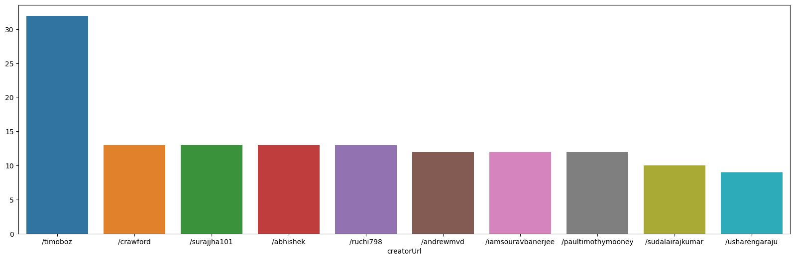
​    


```python
silver_medal = data.loc[data['medal'] == 'silver'].groupby(['creatorUrl'])['medal'].count().sort_values(ascending=False)[:10]
fig, ax = plt.subplots(figsize=(20, 6))
sns.barplot(x=silver_medal.index, y=silver_medal.values, ax = ax)

```


    <Axes: xlabel='creatorUrl'>


​    
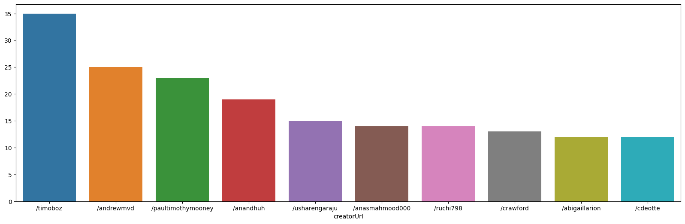
​    


```python
bronze_medal = data.loc[data['medal'] == 'bronze'].groupby(['creatorUrl'])['medal'].count().sort_values(ascending=False)[:10]
fig, ax = plt.subplots(figsize=(20, 6))
sns.barplot(x=bronze_medal.index, y=bronze_medal.values, ax = ax)

```


    <Axes: xlabel='creatorUrl'>


​    
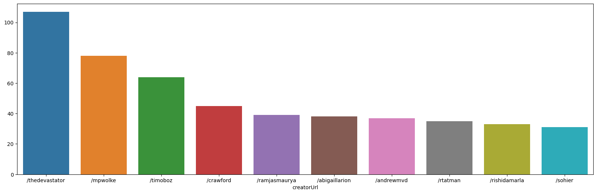
​    


```python
data.loc[data['medal'] == 'gold'].groupby(['creatorUrl'])['medal'].count().sort_values(ascending=False)[:10]
```


    creatorUrl
    /timoboz              32
    /crawford             13
    /surajjha101          13
    /abhishek             13
    /ruchi798             13
    /andrewmvd            12
    /iamsouravbanerjee    12
    /paultimothymooney    12
    /sudalairajkumar      10
    /usharengaraju         9
    Name: medal, dtype: int64


```python
timo = data.loc[data['creatorUrl'] == '/timoboz']['medal'].value_counts()
crawford = data.loc[data['creatorUrl'] == '/crawford']['medal'].value_counts()
sura = data.loc[data['creatorUrl'] == '/surajjha101']['medal'].value_counts()
abhishek = data.loc[data['creatorUrl'] == '/abhishek']['medal'].value_counts()
```


```python
medal_counts = pd.concat([timo, crawford,sura,abhishek], axis=1)
medal_counts.columns = ['Timoboz', 'Crawford', 'Sura', 'Abhishek']
medal_counts.index.name = 'Medal Type'
medal_counts.fillna(0, inplace=True)
medal_counts.plot(kind='bar')
```


    <Axes: xlabel='Medal Type'>


​    
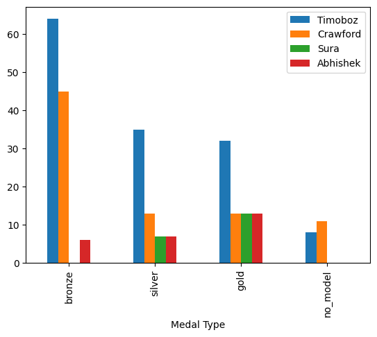
​    


```python
# silver_medal = data.loc[data['medal'] == 'silver'].groupby(['creatorUrl'])['medal'].count().sort_values(ascending=False)[30:40]
# fig, ax = plt.subplots(figsize=(20, 6))
# sns.barplot(x=silver_medal.index, y=silver_medal.values, ax = ax)
```


```python
data.loc[data['medal'] == 'silver'].groupby(['creatorUrl'])['medal'].count().sort_values(ascending=False)[30:40]
```


    creatorUrl
    /alifarajnia       8
    /andradaolteanu    8
    /konradb           8
    /jpmiller          8
    /kaggleteam        8
    /abedi756          8
    /vencerlanz09      8
    /zusmani           8
    /d4rklucif3r       7
    /pythonafroz       7
    Name: medal, dtype: int64


```python
data.loc[data['medal'] == 'silver'].groupby(['creatorUrl'])['medal'].count().sort_values(ascending=False).drop_duplicates()
```


    creatorUrl
    /timoboz              35
    /andrewmvd            25
    /paultimothymooney    23
    /anandhuh             19
    /usharengaraju        15
    /anasmahmood000       14
    /crawford             13
    /abigaillarion        12
    /sohier               11
    /arezalo              10
    /fedesoriano           9
    /azminetoushikwasi     8
    /d4rklucif3r           7
    /sshikamaru            6
    /aryakrishnanar        5
    /kutlukatalay          4
    /shtrausslearning      3
    /ayessa                2
    /prachi13              1
    Name: medal, dtype: int64


```python
alifarajnia = data.loc[data['creatorUrl'] == '/alifarajnia']['medal'].value_counts()
andradaolteanu = data.loc[data['creatorUrl'] == '/andradaolteanu']['medal'].value_counts()
konradb = data.loc[data['creatorUrl'] == '/konradb']['medal'].value_counts()
jpmiller = data.loc[data['creatorUrl'] == '/jpmiller']['medal'].value_counts()
```


```python
medal_counts = pd.concat([alifarajnia, andradaolteanu,konradb,jpmiller], axis=1)
medal_counts.columns = ['alifarajnia', 'andradaolteanu', 'konradb', 'jpmiller']
medal_counts.index.name = 'Medal Type'
medal_counts.fillna(0, inplace=True)
medal_counts.plot(kind='bar')
```


    <Axes: xlabel='Medal Type'>


​    
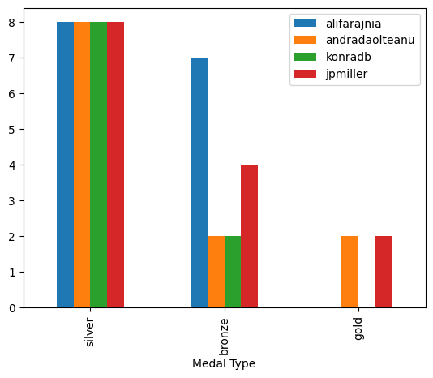
​    


```python
# timoboz -> 1위 gold_medal 2위 silver_medal 3위 bronze_medal 
# crawford -> 2위 gold_medal 8위 silver_medal 4위 bronze_medal
# surajjha -> 골드 13개로 공동 3위 silver_medal 7개 
# abhishek -> 골드만 13개로 공동 3위 
# ruchi798 -> 골드 13개로 공동 3위 silver에서 6위 

# 상위권 골드 메달 획득 유저는 골드를 또 딸 확률이 높으며 silver도 높고 bronze도 높다. 이것의 의미는 전체적 메달 갯수가 높다는 것이다.
# medal prediction이나 total votes를 prediction을 할 때 중요한 요소로 작용한다 
```


```python
def categories_clean(x):
    x = str(x)
    if '|' in x:
        return [int(x) for x in x.split('|')]
    else:
        return [int(x)]
```


```python
# column 에 대한 max categories count
max_count = data['categories'].fillna(0).apply(categories_clean).apply(lambda x: len(x)).max()
max_count
```


    11


```python
# categories matrix 생성 (max rows, max columns)
categories_matrix = np.zeros(shape=(len(data['categories']), max_count))
categories_matrix.shape
```


    (9992, 11)


```python
# 고유 id count
categories_ids = set()

categories_list = data['categories'].fillna(0).apply(categories_clean).tolist()
for idx, row in enumerate(categories_list):
    for j in range(len(row)):
        categories_matrix[idx, j] = row[j]
        categories_ids.add(row[j])
```


```python
# total number of categories
len(categories_ids)
```


    303


### tags


```python
def tags_clean(x):
    x = str(x)
    if '|' in x:
        # tags/ 이후 데이터
        return [xx.split('/')[2] for xx in x.split('|')]
    else:
        return [x.split('/')[2]]
```


```python
tags_max_count = data['tags'].fillna('/tags/None').apply(tags_clean).apply(lambda x: len(x)).max()
tags_max_count
```


    11


```python
# tags matrix 생성 (max rows, max columns)
tags_matrix = np.zeros(shape=(len(data['tags']), tags_max_count))
tags_matrix.shape
```


    (9992, 11)


```python
# 고유 id count
tags_ids = set()
tags_to_categories = dict()

tags_list = data['tags'].fillna('/tags/None').apply(tags_clean).tolist()
for idx, row in enumerate(tags_list):
    for j in range(len(row)):
        tags_to_categories[row[j]] = int(categories_matrix[idx, j])
        tags_ids.add(row[j])
```


```python
categories_to_tags = {v:k for k,v in tags_to_categories.items()}
# categories_to_tags
```


```python
len(categories_to_tags)
```


    303


### categories 숫자 정규화


```python
tags_to_idx_norm = {k:idx for idx, (k,v) in enumerate(tags_to_categories.items())}
idx_to_tags_norm = {v:k for k,v in tags_to_idx_norm.items()}
```


```python
# tags_to_idx_norm
```


```python
# idx_to_tags_norm
```


```python
# 원본 index를 norm index 및 tag 변환
def get_categories_to_norm_index(category_num):
    category_name = categories_to_tags[category_num]
    return tags_to_idx_norm[category_name], category_name
```


```python
# 16151 카테고리의 경우
get_categories_to_norm_index(16151)
```


    (0, 'simulation-games')


```python
# 0 카테고리의 경우
get_categories_to_norm_index(0)
```


    (119, 'None')


```python
tags_matrix_norm = np.zeros(shape=(len(data['tags']), len(idx_to_tags_norm)))
tags_matrix_norm.shape
```


    (9992, 303)


```python
for idx, row in enumerate(categories_matrix):
    for i in range(len(row)):
        norm_idx, tag_name = get_categories_to_norm_index(int(row[i]))
        tags_matrix_norm[idx, norm_idx] = 1
```


```python
tags_matrix_norm_data = pd.DataFrame(tags_matrix_norm)
tags_matrix_norm_data
```


<div>
<style scoped>
    .dataframe tbody tr th:only-of-type {
        vertical-align: middle;
    }


    .dataframe tbody tr th {
        vertical-align: top;
    }
    
    .dataframe thead th {
        text-align: right;
    }

</style>

<table border="1" class="dataframe">
  <thead>
    <tr style="text-align: right;">
      <th></th>
      <th>0</th>
      <th>1</th>
      <th>2</th>
      <th>3</th>
      <th>4</th>
      <th>5</th>
      <th>6</th>
      <th>7</th>
      <th>8</th>
      <th>9</th>
      <th>...</th>
      <th>293</th>
      <th>294</th>
      <th>295</th>
      <th>296</th>
      <th>297</th>
      <th>298</th>
      <th>299</th>
      <th>300</th>
      <th>301</th>
      <th>302</th>
    </tr>
  </thead>
  <tbody>
    <tr>
      <th>0</th>
      <td>1.0</td>
      <td>0.0</td>
      <td>0.0</td>
      <td>0.0</td>
      <td>0.0</td>
      <td>0.0</td>
      <td>0.0</td>
      <td>0.0</td>
      <td>0.0</td>
      <td>0.0</td>
      <td>...</td>
      <td>0.0</td>
      <td>0.0</td>
      <td>0.0</td>
      <td>0.0</td>
      <td>0.0</td>
      <td>0.0</td>
      <td>0.0</td>
      <td>0.0</td>
      <td>0.0</td>
      <td>0.0</td>
    </tr>
    <tr>
      <th>1</th>
      <td>0.0</td>
      <td>1.0</td>
      <td>1.0</td>
      <td>1.0</td>
      <td>1.0</td>
      <td>1.0</td>
      <td>1.0</td>
      <td>0.0</td>
      <td>0.0</td>
      <td>0.0</td>
      <td>...</td>
      <td>0.0</td>
      <td>0.0</td>
      <td>0.0</td>
      <td>0.0</td>
      <td>0.0</td>
      <td>0.0</td>
      <td>0.0</td>
      <td>0.0</td>
      <td>0.0</td>
      <td>0.0</td>
    </tr>
    <tr>
      <th>2</th>
      <td>0.0</td>
      <td>0.0</td>
      <td>0.0</td>
      <td>0.0</td>
      <td>0.0</td>
      <td>0.0</td>
      <td>0.0</td>
      <td>1.0</td>
      <td>1.0</td>
      <td>0.0</td>
      <td>...</td>
      <td>0.0</td>
      <td>0.0</td>
      <td>0.0</td>
      <td>0.0</td>
      <td>0.0</td>
      <td>0.0</td>
      <td>0.0</td>
      <td>0.0</td>
      <td>0.0</td>
      <td>0.0</td>
    </tr>
    <tr>
      <th>3</th>
      <td>0.0</td>
      <td>0.0</td>
      <td>0.0</td>
      <td>0.0</td>
      <td>0.0</td>
      <td>0.0</td>
      <td>0.0</td>
      <td>0.0</td>
      <td>0.0</td>
      <td>1.0</td>
      <td>...</td>
      <td>0.0</td>
      <td>0.0</td>
      <td>0.0</td>
      <td>0.0</td>
      <td>0.0</td>
      <td>0.0</td>
      <td>0.0</td>
      <td>0.0</td>
      <td>0.0</td>
      <td>0.0</td>
    </tr>
    <tr>
      <th>4</th>
      <td>0.0</td>
      <td>1.0</td>
      <td>0.0</td>
      <td>0.0</td>
      <td>0.0</td>
      <td>0.0</td>
      <td>1.0</td>
      <td>0.0</td>
      <td>0.0</td>
      <td>0.0</td>
      <td>...</td>
      <td>0.0</td>
      <td>0.0</td>
      <td>0.0</td>
      <td>0.0</td>
      <td>0.0</td>
      <td>0.0</td>
      <td>0.0</td>
      <td>0.0</td>
      <td>0.0</td>
      <td>0.0</td>
    </tr>
    <tr>
      <th>...</th>
      <td>...</td>
      <td>...</td>
      <td>...</td>
      <td>...</td>
      <td>...</td>
      <td>...</td>
      <td>...</td>
      <td>...</td>
      <td>...</td>
      <td>...</td>
      <td>...</td>
      <td>...</td>
      <td>...</td>
      <td>...</td>
      <td>...</td>
      <td>...</td>
      <td>...</td>
      <td>...</td>
      <td>...</td>
      <td>...</td>
      <td>...</td>
    </tr>
    <tr>
      <th>9987</th>
      <td>0.0</td>
      <td>0.0</td>
      <td>0.0</td>
      <td>0.0</td>
      <td>0.0</td>
      <td>0.0</td>
      <td>0.0</td>
      <td>0.0</td>
      <td>0.0</td>
      <td>0.0</td>
      <td>...</td>
      <td>0.0</td>
      <td>0.0</td>
      <td>0.0</td>
      <td>0.0</td>
      <td>0.0</td>
      <td>0.0</td>
      <td>0.0</td>
      <td>0.0</td>
      <td>0.0</td>
      <td>0.0</td>
    </tr>
    <tr>
      <th>9988</th>
      <td>0.0</td>
      <td>0.0</td>
      <td>0.0</td>
      <td>0.0</td>
      <td>0.0</td>
      <td>0.0</td>
      <td>0.0</td>
      <td>0.0</td>
      <td>0.0</td>
      <td>0.0</td>
      <td>...</td>
      <td>0.0</td>
      <td>0.0</td>
      <td>0.0</td>
      <td>0.0</td>
      <td>0.0</td>
      <td>0.0</td>
      <td>0.0</td>
      <td>0.0</td>
      <td>0.0</td>
      <td>0.0</td>
    </tr>
    <tr>
      <th>9989</th>
      <td>0.0</td>
      <td>0.0</td>
      <td>0.0</td>
      <td>1.0</td>
      <td>0.0</td>
      <td>0.0</td>
      <td>0.0</td>
      <td>0.0</td>
      <td>0.0</td>
      <td>0.0</td>
      <td>...</td>
      <td>0.0</td>
      <td>0.0</td>
      <td>0.0</td>
      <td>0.0</td>
      <td>0.0</td>
      <td>0.0</td>
      <td>0.0</td>
      <td>0.0</td>
      <td>0.0</td>
      <td>0.0</td>
    </tr>
    <tr>
      <th>9990</th>
      <td>0.0</td>
      <td>0.0</td>
      <td>0.0</td>
      <td>0.0</td>
      <td>0.0</td>
      <td>0.0</td>
      <td>0.0</td>
      <td>0.0</td>
      <td>0.0</td>
      <td>0.0</td>
      <td>...</td>
      <td>0.0</td>
      <td>0.0</td>
      <td>0.0</td>
      <td>0.0</td>
      <td>0.0</td>
      <td>0.0</td>
      <td>0.0</td>
      <td>0.0</td>
      <td>0.0</td>
      <td>0.0</td>
    </tr>
    <tr>
      <th>9991</th>
      <td>0.0</td>
      <td>0.0</td>
      <td>0.0</td>
      <td>0.0</td>
      <td>0.0</td>
      <td>0.0</td>
      <td>0.0</td>
      <td>0.0</td>
      <td>0.0</td>
      <td>0.0</td>
      <td>...</td>
      <td>0.0</td>
      <td>0.0</td>
      <td>0.0</td>
      <td>0.0</td>
      <td>0.0</td>
      <td>0.0</td>
      <td>0.0</td>
      <td>0.0</td>
      <td>0.0</td>
      <td>0.0</td>
    </tr>
  </tbody>
</table>
<p>9992 rows × 303 columns</p>

</div>


```python
tags_matrix_norm_data.columns = [idx_to_tags_norm[i] for i in tags_matrix_norm_data.columns]
tags_matrix_norm_data
```


<div>
<style scoped>
    .dataframe tbody tr th:only-of-type {
        vertical-align: middle;
    }


    .dataframe tbody tr th {
        vertical-align: top;
    }
    
    .dataframe thead th {
        text-align: right;
    }

</style>

<table border="1" class="dataframe">
  <thead>
    <tr style="text-align: right;">
      <th></th>
      <th>simulation-games</th>
      <th>public-health</th>
      <th>biology</th>
      <th>business</th>
      <th>computer-science</th>
      <th>nlp</th>
      <th>covid19</th>
      <th>crime</th>
      <th>finance</th>
      <th>web-sites</th>
      <th>...</th>
      <th>os</th>
      <th>geography-and-places</th>
      <th>tabular-classification</th>
      <th>gymnastics</th>
      <th>sys</th>
      <th>convolution</th>
      <th>audio-classification</th>
      <th>PIL</th>
      <th>text-generation</th>
      <th>retrieval-question-answering</th>
    </tr>
  </thead>
  <tbody>
    <tr>
      <th>0</th>
      <td>1.0</td>
      <td>0.0</td>
      <td>0.0</td>
      <td>0.0</td>
      <td>0.0</td>
      <td>0.0</td>
      <td>0.0</td>
      <td>0.0</td>
      <td>0.0</td>
      <td>0.0</td>
      <td>...</td>
      <td>0.0</td>
      <td>0.0</td>
      <td>0.0</td>
      <td>0.0</td>
      <td>0.0</td>
      <td>0.0</td>
      <td>0.0</td>
      <td>0.0</td>
      <td>0.0</td>
      <td>0.0</td>
    </tr>
    <tr>
      <th>1</th>
      <td>0.0</td>
      <td>1.0</td>
      <td>1.0</td>
      <td>1.0</td>
      <td>1.0</td>
      <td>1.0</td>
      <td>1.0</td>
      <td>0.0</td>
      <td>0.0</td>
      <td>0.0</td>
      <td>...</td>
      <td>0.0</td>
      <td>0.0</td>
      <td>0.0</td>
      <td>0.0</td>
      <td>0.0</td>
      <td>0.0</td>
      <td>0.0</td>
      <td>0.0</td>
      <td>0.0</td>
      <td>0.0</td>
    </tr>
    <tr>
      <th>2</th>
      <td>0.0</td>
      <td>0.0</td>
      <td>0.0</td>
      <td>0.0</td>
      <td>0.0</td>
      <td>0.0</td>
      <td>0.0</td>
      <td>1.0</td>
      <td>1.0</td>
      <td>0.0</td>
      <td>...</td>
      <td>0.0</td>
      <td>0.0</td>
      <td>0.0</td>
      <td>0.0</td>
      <td>0.0</td>
      <td>0.0</td>
      <td>0.0</td>
      <td>0.0</td>
      <td>0.0</td>
      <td>0.0</td>
    </tr>
    <tr>
      <th>3</th>
      <td>0.0</td>
      <td>0.0</td>
      <td>0.0</td>
      <td>0.0</td>
      <td>0.0</td>
      <td>0.0</td>
      <td>0.0</td>
      <td>0.0</td>
      <td>0.0</td>
      <td>1.0</td>
      <td>...</td>
      <td>0.0</td>
      <td>0.0</td>
      <td>0.0</td>
      <td>0.0</td>
      <td>0.0</td>
      <td>0.0</td>
      <td>0.0</td>
      <td>0.0</td>
      <td>0.0</td>
      <td>0.0</td>
    </tr>
    <tr>
      <th>4</th>
      <td>0.0</td>
      <td>1.0</td>
      <td>0.0</td>
      <td>0.0</td>
      <td>0.0</td>
      <td>0.0</td>
      <td>1.0</td>
      <td>0.0</td>
      <td>0.0</td>
      <td>0.0</td>
      <td>...</td>
      <td>0.0</td>
      <td>0.0</td>
      <td>0.0</td>
      <td>0.0</td>
      <td>0.0</td>
      <td>0.0</td>
      <td>0.0</td>
      <td>0.0</td>
      <td>0.0</td>
      <td>0.0</td>
    </tr>
    <tr>
      <th>...</th>
      <td>...</td>
      <td>...</td>
      <td>...</td>
      <td>...</td>
      <td>...</td>
      <td>...</td>
      <td>...</td>
      <td>...</td>
      <td>...</td>
      <td>...</td>
      <td>...</td>
      <td>...</td>
      <td>...</td>
      <td>...</td>
      <td>...</td>
      <td>...</td>
      <td>...</td>
      <td>...</td>
      <td>...</td>
      <td>...</td>
      <td>...</td>
    </tr>
    <tr>
      <th>9987</th>
      <td>0.0</td>
      <td>0.0</td>
      <td>0.0</td>
      <td>0.0</td>
      <td>0.0</td>
      <td>0.0</td>
      <td>0.0</td>
      <td>0.0</td>
      <td>0.0</td>
      <td>0.0</td>
      <td>...</td>
      <td>0.0</td>
      <td>0.0</td>
      <td>0.0</td>
      <td>0.0</td>
      <td>0.0</td>
      <td>0.0</td>
      <td>0.0</td>
      <td>0.0</td>
      <td>0.0</td>
      <td>0.0</td>
    </tr>
    <tr>
      <th>9988</th>
      <td>0.0</td>
      <td>0.0</td>
      <td>0.0</td>
      <td>0.0</td>
      <td>0.0</td>
      <td>0.0</td>
      <td>0.0</td>
      <td>0.0</td>
      <td>0.0</td>
      <td>0.0</td>
      <td>...</td>
      <td>0.0</td>
      <td>0.0</td>
      <td>0.0</td>
      <td>0.0</td>
      <td>0.0</td>
      <td>0.0</td>
      <td>0.0</td>
      <td>0.0</td>
      <td>0.0</td>
      <td>0.0</td>
    </tr>
    <tr>
      <th>9989</th>
      <td>0.0</td>
      <td>0.0</td>
      <td>0.0</td>
      <td>1.0</td>
      <td>0.0</td>
      <td>0.0</td>
      <td>0.0</td>
      <td>0.0</td>
      <td>0.0</td>
      <td>0.0</td>
      <td>...</td>
      <td>0.0</td>
      <td>0.0</td>
      <td>0.0</td>
      <td>0.0</td>
      <td>0.0</td>
      <td>0.0</td>
      <td>0.0</td>
      <td>0.0</td>
      <td>0.0</td>
      <td>0.0</td>
    </tr>
    <tr>
      <th>9990</th>
      <td>0.0</td>
      <td>0.0</td>
      <td>0.0</td>
      <td>0.0</td>
      <td>0.0</td>
      <td>0.0</td>
      <td>0.0</td>
      <td>0.0</td>
      <td>0.0</td>
      <td>0.0</td>
      <td>...</td>
      <td>0.0</td>
      <td>0.0</td>
      <td>0.0</td>
      <td>0.0</td>
      <td>0.0</td>
      <td>0.0</td>
      <td>0.0</td>
      <td>0.0</td>
      <td>0.0</td>
      <td>0.0</td>
    </tr>
    <tr>
      <th>9991</th>
      <td>0.0</td>
      <td>0.0</td>
      <td>0.0</td>
      <td>0.0</td>
      <td>0.0</td>
      <td>0.0</td>
      <td>0.0</td>
      <td>0.0</td>
      <td>0.0</td>
      <td>0.0</td>
      <td>...</td>
      <td>0.0</td>
      <td>0.0</td>
      <td>0.0</td>
      <td>0.0</td>
      <td>0.0</td>
      <td>0.0</td>
      <td>0.0</td>
      <td>0.0</td>
      <td>0.0</td>
      <td>0.0</td>
    </tr>
  </tbody>
</table>
<p>9992 rows × 303 columns</p>

</div>


```python
tags_matrix_norm_data.sum(axis=0).sort_values(ascending=False)[1:].head(20).sort_values().plot(kind='barh')
plt.show()
```


​    
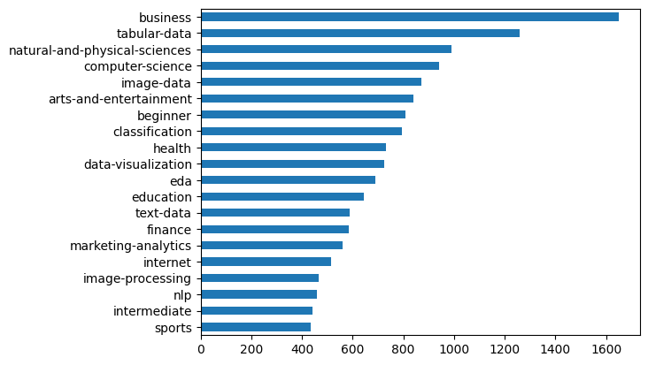
​    


```python
tags_matrix_norm_data.sum(axis=0).sort_values(ascending=True)[1:].head(20).sort_values().plot(kind='barh')
plt.show()
```


​    
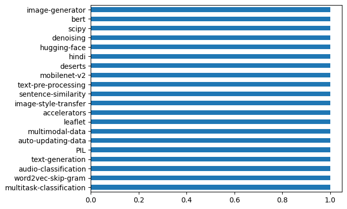
​    


```python
tags_data = pd.concat([tags_matrix_norm_data, 
                     data[['scriptCount', 'viewCount', 'downloadCount', 'dateCreated', 'datasetSize', 'totalVotes', 'usabilityRating', 'medal']]], 
                    axis=1)
```


```python
tags_data.groupby('business')[['scriptCount', 'viewCount', 'downloadCount', 'totalVotes']].mean()
```


<div>
<style scoped>
    .dataframe tbody tr th:only-of-type {
        vertical-align: middle;
    }


    .dataframe tbody tr th {
        vertical-align: top;
    }
    
    .dataframe thead th {
        text-align: right;
    }

</style>

<table border="1" class="dataframe">
  <thead>
    <tr style="text-align: right;">
      <th></th>
      <th>scriptCount</th>
      <th>viewCount</th>
      <th>downloadCount</th>
      <th>totalVotes</th>
    </tr>
    <tr>
      <th>business</th>
      <th></th>
      <th></th>
      <th></th>
      <th></th>
    </tr>
  </thead>
  <tbody>
    <tr>
      <th>0.0</th>
      <td>26.612083</td>
      <td>32308.586430</td>
      <td>4245.629585</td>
      <td>92.496164</td>
    </tr>
    <tr>
      <th>1.0</th>
      <td>37.758182</td>
      <td>47116.261818</td>
      <td>5662.209091</td>
      <td>122.150909</td>
    </tr>
  </tbody>
</table>

</div>


```python
tags_data
```


<div>
<style scoped>
    .dataframe tbody tr th:only-of-type {
        vertical-align: middle;
    }


    .dataframe tbody tr th {
        vertical-align: top;
    }
    
    .dataframe thead th {
        text-align: right;
    }

</style>

<table border="1" class="dataframe">
  <thead>
    <tr style="text-align: right;">
      <th></th>
      <th>simulation-games</th>
      <th>public-health</th>
      <th>biology</th>
      <th>business</th>
      <th>computer-science</th>
      <th>nlp</th>
      <th>covid19</th>
      <th>crime</th>
      <th>finance</th>
      <th>web-sites</th>
      <th>...</th>
      <th>text-generation</th>
      <th>retrieval-question-answering</th>
      <th>scriptCount</th>
      <th>viewCount</th>
      <th>downloadCount</th>
      <th>dateCreated</th>
      <th>datasetSize</th>
      <th>totalVotes</th>
      <th>usabilityRating</th>
      <th>medal</th>
    </tr>
  </thead>
  <tbody>
    <tr>
      <th>0</th>
      <td>1.0</td>
      <td>0.0</td>
      <td>0.0</td>
      <td>0.0</td>
      <td>0.0</td>
      <td>0.0</td>
      <td>0.0</td>
      <td>0.0</td>
      <td>0.0</td>
      <td>0.0</td>
      <td>...</td>
      <td>0.0</td>
      <td>0.0</td>
      <td>26.0</td>
      <td>455383</td>
      <td>36830.0</td>
      <td>2020-05-18T22:50:26.640Z</td>
      <td>5.907700e+05</td>
      <td>29208</td>
      <td>0.823529</td>
      <td>gold</td>
    </tr>
    <tr>
      <th>1</th>
      <td>0.0</td>
      <td>1.0</td>
      <td>1.0</td>
      <td>1.0</td>
      <td>1.0</td>
      <td>1.0</td>
      <td>1.0</td>
      <td>0.0</td>
      <td>0.0</td>
      <td>0.0</td>
      <td>...</td>
      <td>0.0</td>
      <td>0.0</td>
      <td>1695.0</td>
      <td>4327230</td>
      <td>157597.0</td>
      <td>2020-03-12T20:05:08.200Z</td>
      <td>1.972498e+10</td>
      <td>10328</td>
      <td>0.882353</td>
      <td>gold</td>
    </tr>
    <tr>
      <th>2</th>
      <td>0.0</td>
      <td>0.0</td>
      <td>0.0</td>
      <td>0.0</td>
      <td>0.0</td>
      <td>0.0</td>
      <td>0.0</td>
      <td>1.0</td>
      <td>1.0</td>
      <td>0.0</td>
      <td>...</td>
      <td>0.0</td>
      <td>0.0</td>
      <td>4035.0</td>
      <td>9878695</td>
      <td>500554.0</td>
      <td>2016-11-03T13:21:36.757Z</td>
      <td>6.915567e+07</td>
      <td>9897</td>
      <td>0.852941</td>
      <td>gold</td>
    </tr>
    <tr>
      <th>3</th>
      <td>0.0</td>
      <td>0.0</td>
      <td>0.0</td>
      <td>0.0</td>
      <td>0.0</td>
      <td>0.0</td>
      <td>0.0</td>
      <td>0.0</td>
      <td>0.0</td>
      <td>1.0</td>
      <td>...</td>
      <td>0.0</td>
      <td>0.0</td>
      <td>1231.0</td>
      <td>2185984</td>
      <td>317287.0</td>
      <td>2019-12-04T05:57:54.557Z</td>
      <td>1.400865e+06</td>
      <td>7307</td>
      <td>1.000000</td>
      <td>gold</td>
    </tr>
    <tr>
      <th>4</th>
      <td>0.0</td>
      <td>1.0</td>
      <td>0.0</td>
      <td>0.0</td>
      <td>0.0</td>
      <td>0.0</td>
      <td>1.0</td>
      <td>0.0</td>
      <td>0.0</td>
      <td>0.0</td>
      <td>...</td>
      <td>0.0</td>
      <td>0.0</td>
      <td>1623.0</td>
      <td>2343233</td>
      <td>399665.0</td>
      <td>2020-01-30T14:18:33.640Z</td>
      <td>8.928752e+06</td>
      <td>5954</td>
      <td>0.970588</td>
      <td>gold</td>
    </tr>
    <tr>
      <th>...</th>
      <td>...</td>
      <td>...</td>
      <td>...</td>
      <td>...</td>
      <td>...</td>
      <td>...</td>
      <td>...</td>
      <td>...</td>
      <td>...</td>
      <td>...</td>
      <td>...</td>
      <td>...</td>
      <td>...</td>
      <td>...</td>
      <td>...</td>
      <td>...</td>
      <td>...</td>
      <td>...</td>
      <td>...</td>
      <td>...</td>
      <td>...</td>
    </tr>
    <tr>
      <th>9987</th>
      <td>0.0</td>
      <td>0.0</td>
      <td>0.0</td>
      <td>0.0</td>
      <td>0.0</td>
      <td>0.0</td>
      <td>0.0</td>
      <td>0.0</td>
      <td>0.0</td>
      <td>0.0</td>
      <td>...</td>
      <td>0.0</td>
      <td>0.0</td>
      <td>1.0</td>
      <td>1713</td>
      <td>93.0</td>
      <td>2022-09-16T14:00:40.123Z</td>
      <td>2.489340e+05</td>
      <td>21</td>
      <td>1.000000</td>
      <td>bronze</td>
    </tr>
    <tr>
      <th>9988</th>
      <td>0.0</td>
      <td>0.0</td>
      <td>0.0</td>
      <td>0.0</td>
      <td>0.0</td>
      <td>0.0</td>
      <td>0.0</td>
      <td>0.0</td>
      <td>0.0</td>
      <td>0.0</td>
      <td>...</td>
      <td>0.0</td>
      <td>0.0</td>
      <td>4.0</td>
      <td>5476</td>
      <td>804.0</td>
      <td>2022-09-09T06:16:53.267Z</td>
      <td>1.000800e+04</td>
      <td>21</td>
      <td>0.852941</td>
      <td>bronze</td>
    </tr>
    <tr>
      <th>9989</th>
      <td>0.0</td>
      <td>0.0</td>
      <td>0.0</td>
      <td>1.0</td>
      <td>0.0</td>
      <td>0.0</td>
      <td>0.0</td>
      <td>0.0</td>
      <td>0.0</td>
      <td>0.0</td>
      <td>...</td>
      <td>0.0</td>
      <td>0.0</td>
      <td>1.0</td>
      <td>1477</td>
      <td>108.0</td>
      <td>2022-09-18T11:38:11.313Z</td>
      <td>4.136100e+04</td>
      <td>21</td>
      <td>1.000000</td>
      <td>bronze</td>
    </tr>
    <tr>
      <th>9990</th>
      <td>0.0</td>
      <td>0.0</td>
      <td>0.0</td>
      <td>0.0</td>
      <td>0.0</td>
      <td>0.0</td>
      <td>0.0</td>
      <td>0.0</td>
      <td>0.0</td>
      <td>0.0</td>
      <td>...</td>
      <td>0.0</td>
      <td>0.0</td>
      <td>1.0</td>
      <td>302</td>
      <td>26.0</td>
      <td>2022-09-23T16:51:22.507Z</td>
      <td>1.701000e+03</td>
      <td>21</td>
      <td>0.294118</td>
      <td>bronze</td>
    </tr>
    <tr>
      <th>9991</th>
      <td>0.0</td>
      <td>0.0</td>
      <td>0.0</td>
      <td>0.0</td>
      <td>0.0</td>
      <td>0.0</td>
      <td>0.0</td>
      <td>0.0</td>
      <td>0.0</td>
      <td>0.0</td>
      <td>...</td>
      <td>0.0</td>
      <td>0.0</td>
      <td>3.0</td>
      <td>407</td>
      <td>31.0</td>
      <td>2022-09-23T18:26:01.393Z</td>
      <td>3.010000e+02</td>
      <td>21</td>
      <td>0.294118</td>
      <td>bronze</td>
    </tr>
  </tbody>
</table>
<p>9992 rows × 311 columns</p>

</div>


```python
def get_energy_by_column(col_name):
    col_name_matrix = np.array(tags_data[col_name])
    col_name_matrix = col_name_matrix.reshape(-1, 1)
    energy = tags_matrix_norm.T.dot(col_name_matrix)
    energy_data = pd.DataFrame(energy)
    energy_data.columns = ['energy']
    energy_data['category'] = list(tags_matrix_norm_data.columns)
    return energy_data.sort_values('energy', ascending=False)
```


```python
today = pytz.timezone('UTC')
now = datetime.now(today)
now
```


    datetime.datetime(2023, 3, 30, 16, 46, 45, 665940, tzinfo=<UTC>)


```python
today = pytz.timezone('UTC')
now = datetime.now(today)
tags_data['time_diff'] = now - pd.to_datetime(tags_data['dateCreated'])
tags_data['time_diff_days'] = tags_data['time_diff'].dt.days
tags_data.head()
```


<div>
<style scoped>
    .dataframe tbody tr th:only-of-type {
        vertical-align: middle;
    }


    .dataframe tbody tr th {
        vertical-align: top;
    }
    
    .dataframe thead th {
        text-align: right;
    }

</style>

<table border="1" class="dataframe">
  <thead>
    <tr style="text-align: right;">
      <th></th>
      <th>simulation-games</th>
      <th>public-health</th>
      <th>biology</th>
      <th>business</th>
      <th>computer-science</th>
      <th>nlp</th>
      <th>covid19</th>
      <th>crime</th>
      <th>finance</th>
      <th>web-sites</th>
      <th>...</th>
      <th>scriptCount</th>
      <th>viewCount</th>
      <th>downloadCount</th>
      <th>dateCreated</th>
      <th>datasetSize</th>
      <th>totalVotes</th>
      <th>usabilityRating</th>
      <th>medal</th>
      <th>time_diff</th>
      <th>time_diff_days</th>
    </tr>
  </thead>
  <tbody>
    <tr>
      <th>0</th>
      <td>1.0</td>
      <td>0.0</td>
      <td>0.0</td>
      <td>0.0</td>
      <td>0.0</td>
      <td>0.0</td>
      <td>0.0</td>
      <td>0.0</td>
      <td>0.0</td>
      <td>0.0</td>
      <td>...</td>
      <td>26.0</td>
      <td>455383</td>
      <td>36830.0</td>
      <td>2020-05-18T22:50:26.640Z</td>
      <td>5.907700e+05</td>
      <td>29208</td>
      <td>0.823529</td>
      <td>gold</td>
      <td>1045 days 17:56:19.032042</td>
      <td>1045</td>
    </tr>
    <tr>
      <th>1</th>
      <td>0.0</td>
      <td>1.0</td>
      <td>1.0</td>
      <td>1.0</td>
      <td>1.0</td>
      <td>1.0</td>
      <td>1.0</td>
      <td>0.0</td>
      <td>0.0</td>
      <td>0.0</td>
      <td>...</td>
      <td>1695.0</td>
      <td>4327230</td>
      <td>157597.0</td>
      <td>2020-03-12T20:05:08.200Z</td>
      <td>1.972498e+10</td>
      <td>10328</td>
      <td>0.882353</td>
      <td>gold</td>
      <td>1112 days 20:41:37.472042</td>
      <td>1112</td>
    </tr>
    <tr>
      <th>2</th>
      <td>0.0</td>
      <td>0.0</td>
      <td>0.0</td>
      <td>0.0</td>
      <td>0.0</td>
      <td>0.0</td>
      <td>0.0</td>
      <td>1.0</td>
      <td>1.0</td>
      <td>0.0</td>
      <td>...</td>
      <td>4035.0</td>
      <td>9878695</td>
      <td>500554.0</td>
      <td>2016-11-03T13:21:36.757Z</td>
      <td>6.915567e+07</td>
      <td>9897</td>
      <td>0.852941</td>
      <td>gold</td>
      <td>2338 days 03:25:08.915042</td>
      <td>2338</td>
    </tr>
    <tr>
      <th>3</th>
      <td>0.0</td>
      <td>0.0</td>
      <td>0.0</td>
      <td>0.0</td>
      <td>0.0</td>
      <td>0.0</td>
      <td>0.0</td>
      <td>0.0</td>
      <td>0.0</td>
      <td>1.0</td>
      <td>...</td>
      <td>1231.0</td>
      <td>2185984</td>
      <td>317287.0</td>
      <td>2019-12-04T05:57:54.557Z</td>
      <td>1.400865e+06</td>
      <td>7307</td>
      <td>1.000000</td>
      <td>gold</td>
      <td>1212 days 10:48:51.115042</td>
      <td>1212</td>
    </tr>
    <tr>
      <th>4</th>
      <td>0.0</td>
      <td>1.0</td>
      <td>0.0</td>
      <td>0.0</td>
      <td>0.0</td>
      <td>0.0</td>
      <td>1.0</td>
      <td>0.0</td>
      <td>0.0</td>
      <td>0.0</td>
      <td>...</td>
      <td>1623.0</td>
      <td>2343233</td>
      <td>399665.0</td>
      <td>2020-01-30T14:18:33.640Z</td>
      <td>8.928752e+06</td>
      <td>5954</td>
      <td>0.970588</td>
      <td>gold</td>
      <td>1155 days 02:28:12.032042</td>
      <td>1155</td>
    </tr>
  </tbody>
</table>
<p>5 rows × 313 columns</p>

</div>


```python
tags_data['scriptCount_days'] = tags_data['scriptCount'] / tags_data['time_diff_days']
tags_data['viewCount_days'] = tags_data['viewCount'] / tags_data['time_diff_days']
tags_data['downloadCount_days'] = tags_data['downloadCount'] / tags_data['time_diff_days']
tags_data['totalVotes_days'] = tags_data['totalVotes'] / tags_data['time_diff_days']
```


```python
tags_data.head()
```


<div>
<style scoped>
    .dataframe tbody tr th:only-of-type {
        vertical-align: middle;
    }


    .dataframe tbody tr th {
        vertical-align: top;
    }
    
    .dataframe thead th {
        text-align: right;
    }

</style>

<table border="1" class="dataframe">
  <thead>
    <tr style="text-align: right;">
      <th></th>
      <th>simulation-games</th>
      <th>public-health</th>
      <th>biology</th>
      <th>business</th>
      <th>computer-science</th>
      <th>nlp</th>
      <th>covid19</th>
      <th>crime</th>
      <th>finance</th>
      <th>web-sites</th>
      <th>...</th>
      <th>datasetSize</th>
      <th>totalVotes</th>
      <th>usabilityRating</th>
      <th>medal</th>
      <th>time_diff</th>
      <th>time_diff_days</th>
      <th>scriptCount_days</th>
      <th>viewCount_days</th>
      <th>downloadCount_days</th>
      <th>totalVotes_days</th>
    </tr>
  </thead>
  <tbody>
    <tr>
      <th>0</th>
      <td>1.0</td>
      <td>0.0</td>
      <td>0.0</td>
      <td>0.0</td>
      <td>0.0</td>
      <td>0.0</td>
      <td>0.0</td>
      <td>0.0</td>
      <td>0.0</td>
      <td>0.0</td>
      <td>...</td>
      <td>5.907700e+05</td>
      <td>29208</td>
      <td>0.823529</td>
      <td>gold</td>
      <td>1045 days 17:56:19.032042</td>
      <td>1045</td>
      <td>0.024880</td>
      <td>435.773206</td>
      <td>35.244019</td>
      <td>27.950239</td>
    </tr>
    <tr>
      <th>1</th>
      <td>0.0</td>
      <td>1.0</td>
      <td>1.0</td>
      <td>1.0</td>
      <td>1.0</td>
      <td>1.0</td>
      <td>1.0</td>
      <td>0.0</td>
      <td>0.0</td>
      <td>0.0</td>
      <td>...</td>
      <td>1.972498e+10</td>
      <td>10328</td>
      <td>0.882353</td>
      <td>gold</td>
      <td>1112 days 20:41:37.472042</td>
      <td>1112</td>
      <td>1.524281</td>
      <td>3891.393885</td>
      <td>141.723921</td>
      <td>9.287770</td>
    </tr>
    <tr>
      <th>2</th>
      <td>0.0</td>
      <td>0.0</td>
      <td>0.0</td>
      <td>0.0</td>
      <td>0.0</td>
      <td>0.0</td>
      <td>0.0</td>
      <td>1.0</td>
      <td>1.0</td>
      <td>0.0</td>
      <td>...</td>
      <td>6.915567e+07</td>
      <td>9897</td>
      <td>0.852941</td>
      <td>gold</td>
      <td>2338 days 03:25:08.915042</td>
      <td>2338</td>
      <td>1.725834</td>
      <td>4225.275877</td>
      <td>214.094953</td>
      <td>4.233105</td>
    </tr>
    <tr>
      <th>3</th>
      <td>0.0</td>
      <td>0.0</td>
      <td>0.0</td>
      <td>0.0</td>
      <td>0.0</td>
      <td>0.0</td>
      <td>0.0</td>
      <td>0.0</td>
      <td>0.0</td>
      <td>1.0</td>
      <td>...</td>
      <td>1.400865e+06</td>
      <td>7307</td>
      <td>1.000000</td>
      <td>gold</td>
      <td>1212 days 10:48:51.115042</td>
      <td>1212</td>
      <td>1.015677</td>
      <td>1803.617162</td>
      <td>261.787954</td>
      <td>6.028878</td>
    </tr>
    <tr>
      <th>4</th>
      <td>0.0</td>
      <td>1.0</td>
      <td>0.0</td>
      <td>0.0</td>
      <td>0.0</td>
      <td>0.0</td>
      <td>1.0</td>
      <td>0.0</td>
      <td>0.0</td>
      <td>0.0</td>
      <td>...</td>
      <td>8.928752e+06</td>
      <td>5954</td>
      <td>0.970588</td>
      <td>gold</td>
      <td>1155 days 02:28:12.032042</td>
      <td>1155</td>
      <td>1.405195</td>
      <td>2028.773160</td>
      <td>346.030303</td>
      <td>5.154978</td>
    </tr>
  </tbody>
</table>
<p>5 rows × 317 columns</p>

</div>


```python
get_energy_by_column('viewCount')
```


<div>
<style scoped>
    .dataframe tbody tr th:only-of-type {
        vertical-align: middle;
    }


    .dataframe tbody tr th {
        vertical-align: top;
    }
    
    .dataframe thead th {
        text-align: right;
    }

</style>

<table border="1" class="dataframe">
  <thead>
    <tr style="text-align: right;">
      <th></th>
      <th>energy</th>
      <th>category</th>
    </tr>
  </thead>
  <tbody>
    <tr>
      <th>119</th>
      <td>347180532.0</td>
      <td>None</td>
    </tr>
    <tr>
      <th>3</th>
      <td>77741832.0</td>
      <td>business</td>
    </tr>
    <tr>
      <th>42</th>
      <td>46770840.0</td>
      <td>natural-and-physical-sciences</td>
    </tr>
    <tr>
      <th>14</th>
      <td>39612235.0</td>
      <td>health</td>
    </tr>
    <tr>
      <th>4</th>
      <td>39019773.0</td>
      <td>computer-science</td>
    </tr>
    <tr>
      <th>...</th>
      <td>...</td>
      <td>...</td>
    </tr>
    <tr>
      <th>302</th>
      <td>1771.0</td>
      <td>retrieval-question-answering</td>
    </tr>
    <tr>
      <th>300</th>
      <td>1654.0</td>
      <td>PIL</td>
    </tr>
    <tr>
      <th>297</th>
      <td>1610.0</td>
      <td>sys</td>
    </tr>
    <tr>
      <th>280</th>
      <td>1073.0</td>
      <td>sentence-similarity</td>
    </tr>
    <tr>
      <th>278</th>
      <td>318.0</td>
      <td>text-pre-processing</td>
    </tr>
  </tbody>
</table>
<p>303 rows × 2 columns</p>

</div>


```python
get_energy_by_column('totalVotes_days').head(10)
```


<div>
<style scoped>
    .dataframe tbody tr th:only-of-type {
        vertical-align: middle;
    }


    .dataframe tbody tr th {
        vertical-align: top;
    }
    
    .dataframe thead th {
        text-align: right;
    }

</style>

<table border="1" class="dataframe">
  <thead>
    <tr style="text-align: right;">
      <th></th>
      <th>energy</th>
      <th>category</th>
    </tr>
  </thead>
  <tbody>
    <tr>
      <th>119</th>
      <td>1495.473065</td>
      <td>None</td>
    </tr>
    <tr>
      <th>3</th>
      <td>257.737903</td>
      <td>business</td>
    </tr>
    <tr>
      <th>77</th>
      <td>248.317398</td>
      <td>tabular-data</td>
    </tr>
    <tr>
      <th>13</th>
      <td>196.552770</td>
      <td>data-visualization</td>
    </tr>
    <tr>
      <th>26</th>
      <td>187.789298</td>
      <td>classification</td>
    </tr>
    <tr>
      <th>12</th>
      <td>158.621849</td>
      <td>eda</td>
    </tr>
    <tr>
      <th>4</th>
      <td>154.822963</td>
      <td>computer-science</td>
    </tr>
    <tr>
      <th>97</th>
      <td>151.876203</td>
      <td>marketing-analytics</td>
    </tr>
    <tr>
      <th>63</th>
      <td>143.468828</td>
      <td>beginner</td>
    </tr>
    <tr>
      <th>42</th>
      <td>134.541172</td>
      <td>natural-and-physical-sciences</td>
    </tr>
  </tbody>
</table>

</div>


```python
get_energy_by_column('totalVotes_days').tail(10)
```


<div>
<style scoped>
    .dataframe tbody tr th:only-of-type {
        vertical-align: middle;
    }


    .dataframe tbody tr th {
        vertical-align: top;
    }
    
    .dataframe thead th {
        text-align: right;
    }

</style>

<table border="1" class="dataframe">
  <thead>
    <tr style="text-align: right;">
      <th></th>
      <th>energy</th>
      <th>category</th>
    </tr>
  </thead>
  <tbody>
    <tr>
      <th>282</th>
      <td>0.097561</td>
      <td>accelerators</td>
    </tr>
    <tr>
      <th>276</th>
      <td>0.092348</td>
      <td>deserts</td>
    </tr>
    <tr>
      <th>284</th>
      <td>0.075377</td>
      <td>leaflet</td>
    </tr>
    <tr>
      <th>297</th>
      <td>0.073446</td>
      <td>sys</td>
    </tr>
    <tr>
      <th>293</th>
      <td>0.059867</td>
      <td>os</td>
    </tr>
    <tr>
      <th>270</th>
      <td>0.041431</td>
      <td>denoising</td>
    </tr>
    <tr>
      <th>296</th>
      <td>0.029312</td>
      <td>gymnastics</td>
    </tr>
    <tr>
      <th>300</th>
      <td>0.029139</td>
      <td>PIL</td>
    </tr>
    <tr>
      <th>275</th>
      <td>0.028440</td>
      <td>hindi</td>
    </tr>
    <tr>
      <th>281</th>
      <td>0.022297</td>
      <td>auto-updating-data</td>
    </tr>
  </tbody>
</table>

</div>


```python
fig, axs = plt.subplots(nrows=2, ncols=2, figsize=(10, 8))
t = tags_data.groupby('business')[['scriptCount_days', 'viewCount_days', 'downloadCount_days', 'totalVotes_days']].mean().reset_index()
sns.barplot(x="business", y='scriptCount_days', data=t, ax = axs[0,0])
sns.barplot(x="business", y='viewCount_days', data=t, ax = axs[0,1])
sns.barplot(x="business", y='downloadCount_days', data=t, ax = axs[1,0])
sns.barplot(x="business", y='totalVotes_days', data=t, ax = axs[1,1])

```


    <Axes: xlabel='business', ylabel='totalVotes_days'>


​    
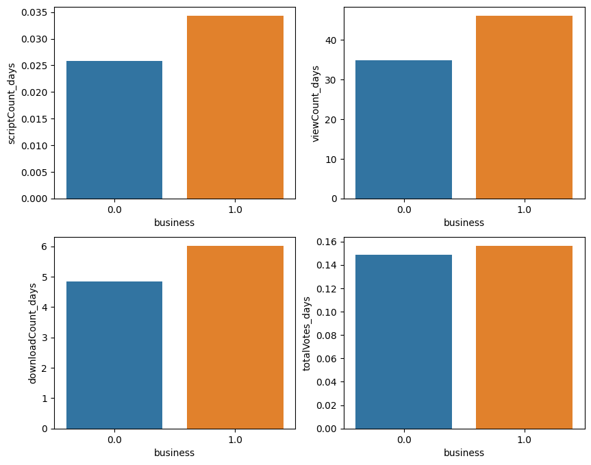
​    


```python
fig, axs = plt.subplots(nrows=2, ncols=2, figsize=(10, 8))
t = tags_data.groupby('eda')[['scriptCount_days', 'viewCount_days', 'downloadCount_days', 'totalVotes_days']].mean().reset_index()
sns.barplot(x="eda", y='scriptCount_days', data=t, ax = axs[0,0])
sns.barplot(x="eda", y='viewCount_days', data=t, ax = axs[0,1])
sns.barplot(x="eda", y='downloadCount_days', data=t, ax = axs[1,0])
sns.barplot(x="eda", y='totalVotes_days', data=t, ax = axs[1,1])

```


    <Axes: xlabel='eda', ylabel='totalVotes_days'>


​    
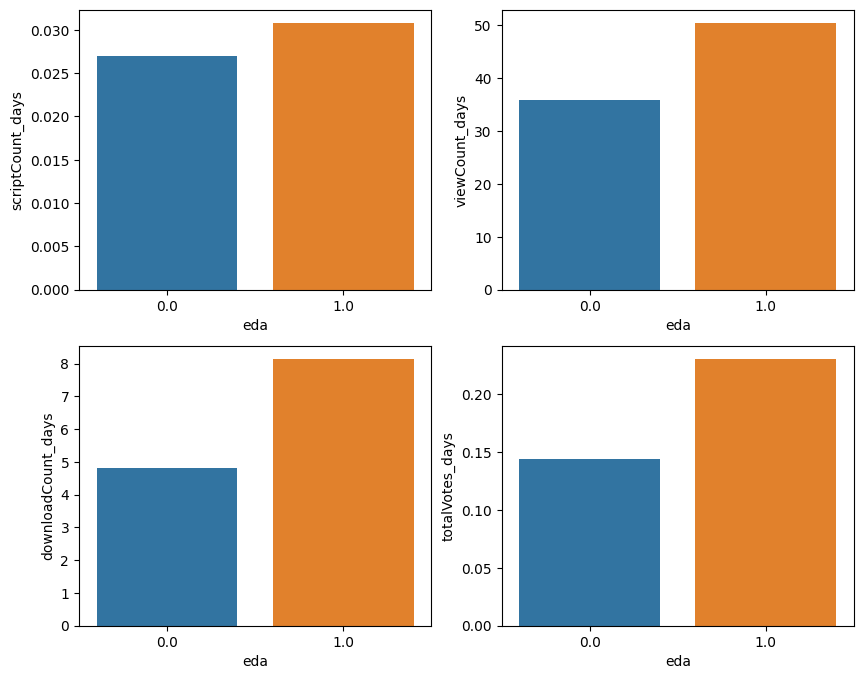
​    


```python
fig, axs = plt.subplots(nrows=2, ncols=2, figsize=(10, 8))
t = tags_data.groupby('data-visualization')[['scriptCount_days', 'viewCount_days', 'downloadCount_days', 'totalVotes_days']].mean().reset_index()
sns.barplot(x="data-visualization", y='scriptCount_days', data=t, ax = axs[0,0])
sns.barplot(x="data-visualization", y='viewCount_days', data=t, ax = axs[0,1])
sns.barplot(x="data-visualization", y='downloadCount_days', data=t, ax = axs[1,0])
sns.barplot(x="data-visualization", y='totalVotes_days', data=t, ax = axs[1,1])

```


    <Axes: xlabel='data-visualization', ylabel='totalVotes_days'>


​    
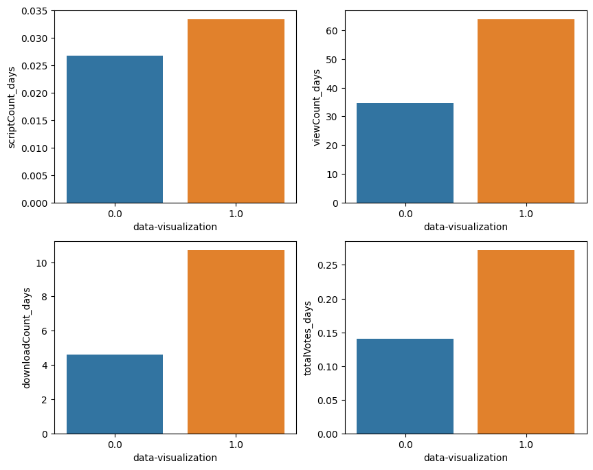
​    


```python
get_energy_by_column('totalVotes_days').tail(10)
```


<div>
<style scoped>
    .dataframe tbody tr th:only-of-type {
        vertical-align: middle;
    }


    .dataframe tbody tr th {
        vertical-align: top;
    }
    
    .dataframe thead th {
        text-align: right;
    }

</style>

<table border="1" class="dataframe">
  <thead>
    <tr style="text-align: right;">
      <th></th>
      <th>energy</th>
      <th>category</th>
    </tr>
  </thead>
  <tbody>
    <tr>
      <th>282</th>
      <td>0.097561</td>
      <td>accelerators</td>
    </tr>
    <tr>
      <th>276</th>
      <td>0.092348</td>
      <td>deserts</td>
    </tr>
    <tr>
      <th>284</th>
      <td>0.075377</td>
      <td>leaflet</td>
    </tr>
    <tr>
      <th>297</th>
      <td>0.073446</td>
      <td>sys</td>
    </tr>
    <tr>
      <th>293</th>
      <td>0.059867</td>
      <td>os</td>
    </tr>
    <tr>
      <th>270</th>
      <td>0.041431</td>
      <td>denoising</td>
    </tr>
    <tr>
      <th>296</th>
      <td>0.029312</td>
      <td>gymnastics</td>
    </tr>
    <tr>
      <th>300</th>
      <td>0.029139</td>
      <td>PIL</td>
    </tr>
    <tr>
      <th>275</th>
      <td>0.028440</td>
      <td>hindi</td>
    </tr>
    <tr>
      <th>281</th>
      <td>0.022297</td>
      <td>auto-updating-data</td>
    </tr>
  </tbody>
</table>

</div>


```python
plt.show()

```


```python
fig, axs = plt.subplots(nrows=2, ncols=2, figsize=(10, 8))
t = tags_data.groupby('hindi')[['scriptCount_days', 'viewCount_days', 'downloadCount_days', 'totalVotes_days']].mean().reset_index()
sns.barplot(x="hindi", y='scriptCount_days', data=t, ax = axs[0,0])
sns.barplot(x="hindi", y='viewCount_days', data=t, ax = axs[0,1])
sns.barplot(x="hindi", y='downloadCount_days', data=t, ax = axs[1,0])
sns.barplot(x="hindi", y='totalVotes_days', data=t, ax = axs[1,1])
```


    <Axes: xlabel='hindi', ylabel='totalVotes_days'>


​    
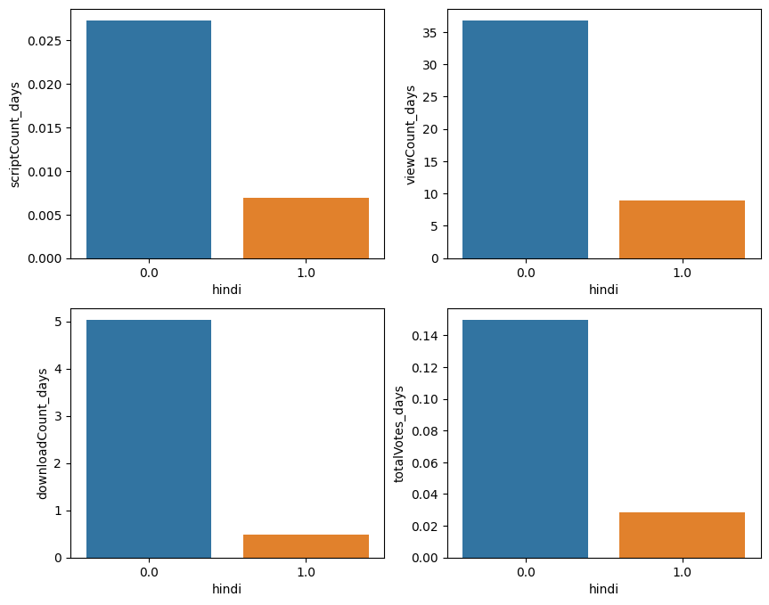
​    


```python
tags_data.groupby('PIL')[['scriptCount_days', 'viewCount_days', 'downloadCount_days', 'totalVotes_days']].mean()
```


<div>
<style scoped>
    .dataframe tbody tr th:only-of-type {
        vertical-align: middle;
    }


    .dataframe tbody tr th {
        vertical-align: top;
    }
    
    .dataframe thead th {
        text-align: right;
    }

</style>

<table border="1" class="dataframe">
  <thead>
    <tr style="text-align: right;">
      <th></th>
      <th>scriptCount_days</th>
      <th>viewCount_days</th>
      <th>downloadCount_days</th>
      <th>totalVotes_days</th>
    </tr>
    <tr>
      <th>PIL</th>
      <th></th>
      <th></th>
      <th></th>
      <th></th>
    </tr>
  </thead>
  <tbody>
    <tr>
      <th>0.0</th>
      <td>0.027227</td>
      <td>36.765809</td>
      <td>5.030928</td>
      <td>0.149691</td>
    </tr>
    <tr>
      <th>1.0</th>
      <td>0.010596</td>
      <td>2.190728</td>
      <td>0.091391</td>
      <td>0.029139</td>
    </tr>
  </tbody>
</table>

</div>


```python
most_energies = [v for v in get_energy_by_column('totalVotes_days').head(20)['category'].values if v != 'None']
most_energies[:5]
```


    ['business', 'tabular-data', 'data-visualization', 'classification', 'eda']


```python
col = 'totalVotes_days'
most_energies_sum = []
for c in most_energies:
    value = tags_data.groupby(c)[col].mean()[1.0]
    most_energies_sum.append(value)
np.array(most_energies_sum).mean()
```


    0.18367286686609108


```python
least_energies = [v for v in get_energy_by_column('totalVotes_days').tail(20)['category'].values if v != 'None']
least_energies[:5]
```


    ['scipy', 'dimensionality-reduction', 'bert', 'word2vec-skip-gram', 'running']


```python
col = 'totalVotes_days'
least_energies_sum = []
for c in least_energies:
    value = tags_data.groupby(c)[col].mean()[1.0]
    least_energies_sum.append(value)
np.array(least_energies_sum).mean()
```


    0.10120174931927073


## 데이터 전처리 모델


```python
# rank, ownerUrl, dateCreated, dateUpdated, datasetId categories, tags 없애기 
```


```python
def data_split(x):
    if x[:4] == '2023':
        return 1
    else:
        return 0
```


```python
data[['categories', 'tags']]
```


<div>
<style scoped>
    .dataframe tbody tr th:only-of-type {
        vertical-align: middle;
    }


    .dataframe tbody tr th {
        vertical-align: top;
    }
    
    .dataframe thead th {
        text-align: right;
    }

</style>

<table border="1" class="dataframe">
  <thead>
    <tr style="text-align: right;">
      <th></th>
      <th>categories</th>
      <th>tags</th>
    </tr>
  </thead>
  <tbody>
    <tr>
      <th>0</th>
      <td>16151</td>
      <td>/tags/simulation-games</td>
    </tr>
    <tr>
      <th>1</th>
      <td>4309|7100|11102|12107|13204|16575</td>
      <td>/tags/public-health|/tags/biology|/tags/busine...</td>
    </tr>
    <tr>
      <th>2</th>
      <td>11104|11108</td>
      <td>/tags/crime|/tags/finance</td>
    </tr>
    <tr>
      <th>3</th>
      <td>1115|2200|2303|13201|13208</td>
      <td>/tags/web-sites|/tags/arts-and-entertainment|/...</td>
    </tr>
    <tr>
      <th>4</th>
      <td>4309|11111|11115|16378|16575</td>
      <td>/tags/public-health|/tags/health|/tags/law|/ta...</td>
    </tr>
    <tr>
      <th>...</th>
      <td>...</td>
      <td>...</td>
    </tr>
    <tr>
      <th>9987</th>
      <td>4171|11111|14101</td>
      <td>/tags/mental-health|/tags/health|/tags/tabular...</td>
    </tr>
    <tr>
      <th>9988</th>
      <td>11200|11205</td>
      <td>/tags/social-sciences|/tags/economics</td>
    </tr>
    <tr>
      <th>9989</th>
      <td>11102|13102|13205|13215|14104</td>
      <td>/tags/business|/tags/beginner|/tags/text-minin...</td>
    </tr>
    <tr>
      <th>9990</th>
      <td>4130</td>
      <td>/tags/exercise</td>
    </tr>
    <tr>
      <th>9991</th>
      <td>1222</td>
      <td>/tags/universities-and-colleges</td>
    </tr>
  </tbody>
</table>
<p>9992 rows × 2 columns</p>

</div>


```python
tags_data
```


<div>
<style scoped>
    .dataframe tbody tr th:only-of-type {
        vertical-align: middle;
    }


    .dataframe tbody tr th {
        vertical-align: top;
    }
    
    .dataframe thead th {
        text-align: right;
    }

</style>

<table border="1" class="dataframe">
  <thead>
    <tr style="text-align: right;">
      <th></th>
      <th>simulation-games</th>
      <th>public-health</th>
      <th>biology</th>
      <th>business</th>
      <th>computer-science</th>
      <th>nlp</th>
      <th>covid19</th>
      <th>crime</th>
      <th>finance</th>
      <th>web-sites</th>
      <th>...</th>
      <th>datasetSize</th>
      <th>totalVotes</th>
      <th>usabilityRating</th>
      <th>medal</th>
      <th>time_diff</th>
      <th>time_diff_days</th>
      <th>scriptCount_days</th>
      <th>viewCount_days</th>
      <th>downloadCount_days</th>
      <th>totalVotes_days</th>
    </tr>
  </thead>
  <tbody>
    <tr>
      <th>0</th>
      <td>1.0</td>
      <td>0.0</td>
      <td>0.0</td>
      <td>0.0</td>
      <td>0.0</td>
      <td>0.0</td>
      <td>0.0</td>
      <td>0.0</td>
      <td>0.0</td>
      <td>0.0</td>
      <td>...</td>
      <td>5.907700e+05</td>
      <td>29208</td>
      <td>0.823529</td>
      <td>gold</td>
      <td>1045 days 17:56:19.032042</td>
      <td>1045</td>
      <td>0.024880</td>
      <td>435.773206</td>
      <td>35.244019</td>
      <td>27.950239</td>
    </tr>
    <tr>
      <th>1</th>
      <td>0.0</td>
      <td>1.0</td>
      <td>1.0</td>
      <td>1.0</td>
      <td>1.0</td>
      <td>1.0</td>
      <td>1.0</td>
      <td>0.0</td>
      <td>0.0</td>
      <td>0.0</td>
      <td>...</td>
      <td>1.972498e+10</td>
      <td>10328</td>
      <td>0.882353</td>
      <td>gold</td>
      <td>1112 days 20:41:37.472042</td>
      <td>1112</td>
      <td>1.524281</td>
      <td>3891.393885</td>
      <td>141.723921</td>
      <td>9.287770</td>
    </tr>
    <tr>
      <th>2</th>
      <td>0.0</td>
      <td>0.0</td>
      <td>0.0</td>
      <td>0.0</td>
      <td>0.0</td>
      <td>0.0</td>
      <td>0.0</td>
      <td>1.0</td>
      <td>1.0</td>
      <td>0.0</td>
      <td>...</td>
      <td>6.915567e+07</td>
      <td>9897</td>
      <td>0.852941</td>
      <td>gold</td>
      <td>2338 days 03:25:08.915042</td>
      <td>2338</td>
      <td>1.725834</td>
      <td>4225.275877</td>
      <td>214.094953</td>
      <td>4.233105</td>
    </tr>
    <tr>
      <th>3</th>
      <td>0.0</td>
      <td>0.0</td>
      <td>0.0</td>
      <td>0.0</td>
      <td>0.0</td>
      <td>0.0</td>
      <td>0.0</td>
      <td>0.0</td>
      <td>0.0</td>
      <td>1.0</td>
      <td>...</td>
      <td>1.400865e+06</td>
      <td>7307</td>
      <td>1.000000</td>
      <td>gold</td>
      <td>1212 days 10:48:51.115042</td>
      <td>1212</td>
      <td>1.015677</td>
      <td>1803.617162</td>
      <td>261.787954</td>
      <td>6.028878</td>
    </tr>
    <tr>
      <th>4</th>
      <td>0.0</td>
      <td>1.0</td>
      <td>0.0</td>
      <td>0.0</td>
      <td>0.0</td>
      <td>0.0</td>
      <td>1.0</td>
      <td>0.0</td>
      <td>0.0</td>
      <td>0.0</td>
      <td>...</td>
      <td>8.928752e+06</td>
      <td>5954</td>
      <td>0.970588</td>
      <td>gold</td>
      <td>1155 days 02:28:12.032042</td>
      <td>1155</td>
      <td>1.405195</td>
      <td>2028.773160</td>
      <td>346.030303</td>
      <td>5.154978</td>
    </tr>
    <tr>
      <th>...</th>
      <td>...</td>
      <td>...</td>
      <td>...</td>
      <td>...</td>
      <td>...</td>
      <td>...</td>
      <td>...</td>
      <td>...</td>
      <td>...</td>
      <td>...</td>
      <td>...</td>
      <td>...</td>
      <td>...</td>
      <td>...</td>
      <td>...</td>
      <td>...</td>
      <td>...</td>
      <td>...</td>
      <td>...</td>
      <td>...</td>
      <td>...</td>
    </tr>
    <tr>
      <th>9987</th>
      <td>0.0</td>
      <td>0.0</td>
      <td>0.0</td>
      <td>0.0</td>
      <td>0.0</td>
      <td>0.0</td>
      <td>0.0</td>
      <td>0.0</td>
      <td>0.0</td>
      <td>0.0</td>
      <td>...</td>
      <td>2.489340e+05</td>
      <td>21</td>
      <td>1.000000</td>
      <td>bronze</td>
      <td>195 days 02:46:05.549042</td>
      <td>195</td>
      <td>0.005128</td>
      <td>8.784615</td>
      <td>0.476923</td>
      <td>0.107692</td>
    </tr>
    <tr>
      <th>9988</th>
      <td>0.0</td>
      <td>0.0</td>
      <td>0.0</td>
      <td>0.0</td>
      <td>0.0</td>
      <td>0.0</td>
      <td>0.0</td>
      <td>0.0</td>
      <td>0.0</td>
      <td>0.0</td>
      <td>...</td>
      <td>1.000800e+04</td>
      <td>21</td>
      <td>0.852941</td>
      <td>bronze</td>
      <td>202 days 10:29:52.405042</td>
      <td>202</td>
      <td>0.019802</td>
      <td>27.108911</td>
      <td>3.980198</td>
      <td>0.103960</td>
    </tr>
    <tr>
      <th>9989</th>
      <td>0.0</td>
      <td>0.0</td>
      <td>0.0</td>
      <td>1.0</td>
      <td>0.0</td>
      <td>0.0</td>
      <td>0.0</td>
      <td>0.0</td>
      <td>0.0</td>
      <td>0.0</td>
      <td>...</td>
      <td>4.136100e+04</td>
      <td>21</td>
      <td>1.000000</td>
      <td>bronze</td>
      <td>193 days 05:08:34.359042</td>
      <td>193</td>
      <td>0.005181</td>
      <td>7.652850</td>
      <td>0.559585</td>
      <td>0.108808</td>
    </tr>
    <tr>
      <th>9990</th>
      <td>0.0</td>
      <td>0.0</td>
      <td>0.0</td>
      <td>0.0</td>
      <td>0.0</td>
      <td>0.0</td>
      <td>0.0</td>
      <td>0.0</td>
      <td>0.0</td>
      <td>0.0</td>
      <td>...</td>
      <td>1.701000e+03</td>
      <td>21</td>
      <td>0.294118</td>
      <td>bronze</td>
      <td>187 days 23:55:23.165042</td>
      <td>187</td>
      <td>0.005348</td>
      <td>1.614973</td>
      <td>0.139037</td>
      <td>0.112299</td>
    </tr>
    <tr>
      <th>9991</th>
      <td>0.0</td>
      <td>0.0</td>
      <td>0.0</td>
      <td>0.0</td>
      <td>0.0</td>
      <td>0.0</td>
      <td>0.0</td>
      <td>0.0</td>
      <td>0.0</td>
      <td>0.0</td>
      <td>...</td>
      <td>3.010000e+02</td>
      <td>21</td>
      <td>0.294118</td>
      <td>bronze</td>
      <td>187 days 22:20:44.279042</td>
      <td>187</td>
      <td>0.016043</td>
      <td>2.176471</td>
      <td>0.165775</td>
      <td>0.112299</td>
    </tr>
  </tbody>
</table>
<p>9992 rows × 317 columns</p>

</div>


```python
train
```


<div>
<style scoped>
    .dataframe tbody tr th:only-of-type {
        vertical-align: middle;
    }


    .dataframe tbody tr th {
        vertical-align: top;
    }
    
    .dataframe thead th {
        text-align: right;
    }

</style>

<table border="1" class="dataframe">
  <thead>
    <tr style="text-align: right;">
      <th></th>
      <th>creatorUrl</th>
      <th>scriptCount</th>
      <th>viewCount</th>
      <th>downloadCount</th>
      <th>datasetSize</th>
      <th>totalVotes</th>
      <th>usabilityRating</th>
      <th>medal</th>
      <th>dc</th>
      <th>time_diff_days</th>
    </tr>
  </thead>
  <tbody>
    <tr>
      <th>0</th>
      <td>/jessicali9530</td>
      <td>-0.021444</td>
      <td>2.819434</td>
      <td>1.905910</td>
      <td>-0.136716</td>
      <td>29208</td>
      <td>0.823529</td>
      <td>gold</td>
      <td>0</td>
      <td>1045</td>
    </tr>
    <tr>
      <th>1</th>
      <td>/paultimothymooney</td>
      <td>10.372803</td>
      <td>28.843488</td>
      <td>9.052083</td>
      <td>3.375060</td>
      <td>10328</td>
      <td>0.882353</td>
      <td>gold</td>
      <td>0</td>
      <td>1112</td>
    </tr>
    <tr>
      <th>2</th>
      <td>/timoboz</td>
      <td>24.945923</td>
      <td>66.156850</td>
      <td>29.345955</td>
      <td>-0.124508</td>
      <td>9897</td>
      <td>0.852941</td>
      <td>gold</td>
      <td>0</td>
      <td>2338</td>
    </tr>
    <tr>
      <th>3</th>
      <td>/shivamb</td>
      <td>7.483090</td>
      <td>14.451416</td>
      <td>18.501455</td>
      <td>-0.136571</td>
      <td>7307</td>
      <td>1.000000</td>
      <td>gold</td>
      <td>0</td>
      <td>1212</td>
    </tr>
    <tr>
      <th>4</th>
      <td>/sudalairajkumar</td>
      <td>9.924399</td>
      <td>15.508342</td>
      <td>23.376027</td>
      <td>-0.135231</td>
      <td>5954</td>
      <td>0.970588</td>
      <td>gold</td>
      <td>0</td>
      <td>1155</td>
    </tr>
    <tr>
      <th>...</th>
      <td>...</td>
      <td>...</td>
      <td>...</td>
      <td>...</td>
      <td>...</td>
      <td>...</td>
      <td>...</td>
      <td>...</td>
      <td>...</td>
      <td>...</td>
    </tr>
    <tr>
      <th>9987</th>
      <td>/mpwolke</td>
      <td>-0.177140</td>
      <td>-0.229843</td>
      <td>-0.267937</td>
      <td>-0.136776</td>
      <td>21</td>
      <td>1.000000</td>
      <td>bronze</td>
      <td>0</td>
      <td>195</td>
    </tr>
    <tr>
      <th>9988</th>
      <td>/sagarvarandekar</td>
      <td>-0.158457</td>
      <td>-0.204551</td>
      <td>-0.225864</td>
      <td>-0.136819</td>
      <td>21</td>
      <td>0.852941</td>
      <td>bronze</td>
      <td>0</td>
      <td>202</td>
    </tr>
    <tr>
      <th>9989</th>
      <td>/luiaalvarez</td>
      <td>-0.177140</td>
      <td>-0.231429</td>
      <td>-0.267049</td>
      <td>-0.136813</td>
      <td>21</td>
      <td>1.000000</td>
      <td>bronze</td>
      <td>0</td>
      <td>193</td>
    </tr>
    <tr>
      <th>9990</th>
      <td>/serkanp</td>
      <td>-0.177140</td>
      <td>-0.239327</td>
      <td>-0.271901</td>
      <td>-0.136821</td>
      <td>21</td>
      <td>0.294118</td>
      <td>bronze</td>
      <td>0</td>
      <td>187</td>
    </tr>
    <tr>
      <th>9991</th>
      <td>/mafhhdeveolper</td>
      <td>-0.164684</td>
      <td>-0.238621</td>
      <td>-0.271605</td>
      <td>-0.136821</td>
      <td>21</td>
      <td>0.294118</td>
      <td>bronze</td>
      <td>0</td>
      <td>187</td>
    </tr>
  </tbody>
</table>
<p>9535 rows × 10 columns</p>

</div>


```python
def data_split(x):
    if x[:4] == '2023':
        return 1
    else:
        return 0
data['dc'] = data['dateCreated'].apply(data_split)
train = data.loc[data['dc'] == 0]
ss = StandardScaler()
train = train.drop(['rank', 'datasetUrl', 'ownerUrl', 'dateCreated', 'dateUpdated', 'datasetId', 'categories', 'tags'], axis = 1)
ss = StandardScaler()
train['time_diff_days']  = tags_data['time_diff_days']
train['downloadCount'] = ss.fit_transform(train['downloadCount'].values.reshape(-1,1))
train['viewCount'] = ss.fit_transform(train['viewCount'].values.reshape(-1,1))
train['scriptCount'] = ss.fit_transform(train['scriptCount'].values.reshape(-1,1))
train['datasetSize'] = ss.fit_transform(train['datasetSize'].values.reshape(-1,1))
train['medal'] = train['medal'].fillna('no_medal')
train['scriptCount'] = train['scriptCount'].fillna(0)
train['downloadCount'] = train['downloadCount'].fillna(0)
```


```python
from sklearn.decomposition import PCA
p = PCA(n_components=5)
x1 = p.fit_transform(tags_matrix_norm_data)
p_df = pd.DataFrame(x1, columns = ['PCA1', 'PCA2', 'PCA3', 'PCA4', 'PCA5'])
train = pd.concat([train, p_df], axis =1)

```


```python
# bronze
b_w = data['medal'].value_counts()[0]/sum(data['medal'].value_counts())*100  / (data['medal'].value_counts()[0]/sum(data['medal'].value_counts())*100)
# silver
s_w =data['medal'].value_counts()[0]/sum(data['medal'].value_counts())*100 / (data['medal'].value_counts()[1]/sum(data['medal'].value_counts())*100)
# gold 
g_w = data['medal'].value_counts()[0]/sum(data['medal'].value_counts())*100 / (data['medal'].value_counts()[2]/sum(data['medal'].value_counts())*100)
```


```python
medal_score = {
    'gold': g_w,
    'silver': s_w,
    'bronze': b_w,
    'no_medal': 0
}
sample = pd.DataFrame(train.groupby('creatorUrl')['medal'].apply(
    lambda x: x.map(medal_score).sum()).fillna(0.0)).reset_index()
train = pd.merge(train, sample, on='creatorUrl', how='inner')
train = train.sample(frac = 1)
```


```python
def medal_convert(x):
    if x == 'bronze':
        return 1
    elif x == 'silver':
        return 2
    elif x == 'gold':
        return 3
    else:
        return 0
```


```python
train['usabilityRating'] = train['usabilityRating'].fillna(-999)
train['datasetSize'] = train['datasetSize'].fillna(-999)
train = train.loc[train['usabilityRating'] != -999]
train = train.loc[train['datasetSize'] != -999]
train['medal_x'] = train['medal_x'].apply(medal_convert)
train = train.rename(columns = {'medal_y': 'creatorWeight', 'medal_x': 'medal'})
train = train.drop(['creatorUrl', 'dc', 'medal'], axis = 1)
train['creatorWeight'] = ss.fit_transform(train['creatorWeight'].values.reshape(-1,1))
train
```


<div>
<style scoped>
    .dataframe tbody tr th:only-of-type {
        vertical-align: middle;
    }


    .dataframe tbody tr th {
        vertical-align: top;
    }
    
    .dataframe thead th {
        text-align: right;
    }

</style>

<table border="1" class="dataframe">
  <thead>
    <tr style="text-align: right;">
      <th></th>
      <th>scriptCount</th>
      <th>viewCount</th>
      <th>downloadCount</th>
      <th>datasetSize</th>
      <th>totalVotes</th>
      <th>usabilityRating</th>
      <th>time_diff_days</th>
      <th>PCA1</th>
      <th>PCA2</th>
      <th>PCA3</th>
      <th>PCA4</th>
      <th>PCA5</th>
      <th>creatorWeight</th>
    </tr>
  </thead>
  <tbody>
    <tr>
      <th>1327</th>
      <td>-0.108634</td>
      <td>-0.192768</td>
      <td>-0.193733</td>
      <td>-0.136812</td>
      <td>133.0</td>
      <td>1.000000</td>
      <td>314.0</td>
      <td>0.611693</td>
      <td>-0.473185</td>
      <td>-0.000831</td>
      <td>-0.145110</td>
      <td>-0.041390</td>
      <td>1.282314</td>
    </tr>
    <tr>
      <th>7593</th>
      <td>-0.177140</td>
      <td>-0.193514</td>
      <td>-0.225864</td>
      <td>-0.136594</td>
      <td>22.0</td>
      <td>1.000000</td>
      <td>416.0</td>
      <td>0.220603</td>
      <td>0.803001</td>
      <td>0.164743</td>
      <td>0.365360</td>
      <td>-0.172190</td>
      <td>-0.466847</td>
    </tr>
    <tr>
      <th>2737</th>
      <td>-0.183368</td>
      <td>-0.151949</td>
      <td>-0.215627</td>
      <td>0.086005</td>
      <td>44.0</td>
      <td>0.687500</td>
      <td>641.0</td>
      <td>-0.387067</td>
      <td>0.121220</td>
      <td>0.901562</td>
      <td>0.228740</td>
      <td>-0.006656</td>
      <td>-0.279944</td>
    </tr>
    <tr>
      <th>9207</th>
      <td>-0.183368</td>
      <td>-0.235361</td>
      <td>-0.271724</td>
      <td>-0.136820</td>
      <td>23.0</td>
      <td>0.235294</td>
      <td>781.0</td>
      <td>-0.040449</td>
      <td>-0.026885</td>
      <td>-0.258237</td>
      <td>0.150903</td>
      <td>0.161203</td>
      <td>-0.486242</td>
    </tr>
    <tr>
      <th>5677</th>
      <td>-0.164684</td>
      <td>-0.023088</td>
      <td>0.005858</td>
      <td>-0.136817</td>
      <td>55.0</td>
      <td>0.529412</td>
      <td>1742.0</td>
      <td>0.611693</td>
      <td>-0.473185</td>
      <td>-0.000831</td>
      <td>-0.145110</td>
      <td>-0.041390</td>
      <td>-0.505638</td>
    </tr>
    <tr>
      <th>...</th>
      <td>...</td>
      <td>...</td>
      <td>...</td>
      <td>...</td>
      <td>...</td>
      <td>...</td>
      <td>...</td>
      <td>...</td>
      <td>...</td>
      <td>...</td>
      <td>...</td>
      <td>...</td>
      <td>...</td>
    </tr>
    <tr>
      <th>4326</th>
      <td>0.059518</td>
      <td>-0.099805</td>
      <td>-0.087991</td>
      <td>-0.128667</td>
      <td>83.0</td>
      <td>0.823529</td>
      <td>1844.0</td>
      <td>-0.265888</td>
      <td>-0.020362</td>
      <td>-0.177553</td>
      <td>-0.016385</td>
      <td>-0.691044</td>
      <td>-0.395636</td>
    </tr>
    <tr>
      <th>3068</th>
      <td>-0.114862</td>
      <td>-0.030582</td>
      <td>-0.009409</td>
      <td>-0.136820</td>
      <td>52.0</td>
      <td>0.588235</td>
      <td>2348.0</td>
      <td>-0.108980</td>
      <td>0.004132</td>
      <td>-0.261964</td>
      <td>-0.032516</td>
      <td>-0.034166</td>
      <td>-0.415713</td>
    </tr>
    <tr>
      <th>6444</th>
      <td>-0.183368</td>
      <td>-0.239071</td>
      <td>-0.271309</td>
      <td>-0.136557</td>
      <td>36.0</td>
      <td>0.294118</td>
      <td>235.0</td>
      <td>-0.108483</td>
      <td>0.001027</td>
      <td>-0.259424</td>
      <td>-0.023223</td>
      <td>-0.030330</td>
      <td>-0.108911</td>
    </tr>
    <tr>
      <th>5093</th>
      <td>-0.102406</td>
      <td>-0.034608</td>
      <td>-0.133436</td>
      <td>-0.133091</td>
      <td>64.0</td>
      <td>0.705882</td>
      <td>1591.0</td>
      <td>-1.078265</td>
      <td>-0.547134</td>
      <td>1.334798</td>
      <td>-0.128806</td>
      <td>-0.479804</td>
      <td>-0.486242</td>
    </tr>
    <tr>
      <th>1450</th>
      <td>0.352225</td>
      <td>0.473063</td>
      <td>0.330246</td>
      <td>-0.135600</td>
      <td>253.0</td>
      <td>1.000000</td>
      <td>943.0</td>
      <td>-0.058546</td>
      <td>0.494941</td>
      <td>0.083681</td>
      <td>-0.092160</td>
      <td>0.516454</td>
      <td>-0.066995</td>
    </tr>
  </tbody>
</table>
<p>9535 rows × 13 columns</p>

</div>


```python
train.head(10)
```


<div>
<style scoped>
    .dataframe tbody tr th:only-of-type {
        vertical-align: middle;
    }


    .dataframe tbody tr th {
        vertical-align: top;
    }
    
    .dataframe thead th {
        text-align: right;
    }

</style>

<table border="1" class="dataframe">
  <thead>
    <tr style="text-align: right;">
      <th></th>
      <th>scriptCount</th>
      <th>viewCount</th>
      <th>downloadCount</th>
      <th>datasetSize</th>
      <th>totalVotes</th>
      <th>usabilityRating</th>
      <th>time_diff_days</th>
      <th>PCA1</th>
      <th>PCA2</th>
      <th>PCA3</th>
      <th>PCA4</th>
      <th>PCA5</th>
      <th>creatorWeight</th>
    </tr>
  </thead>
  <tbody>
    <tr>
      <th>1327</th>
      <td>-0.108634</td>
      <td>-0.192768</td>
      <td>-0.193733</td>
      <td>-0.136812</td>
      <td>133.0</td>
      <td>1.000000</td>
      <td>314.0</td>
      <td>0.611693</td>
      <td>-0.473185</td>
      <td>-0.000831</td>
      <td>-0.145110</td>
      <td>-0.041390</td>
      <td>1.282314</td>
    </tr>
    <tr>
      <th>7593</th>
      <td>-0.177140</td>
      <td>-0.193514</td>
      <td>-0.225864</td>
      <td>-0.136594</td>
      <td>22.0</td>
      <td>1.000000</td>
      <td>416.0</td>
      <td>0.220603</td>
      <td>0.803001</td>
      <td>0.164743</td>
      <td>0.365360</td>
      <td>-0.172190</td>
      <td>-0.466847</td>
    </tr>
    <tr>
      <th>2737</th>
      <td>-0.183368</td>
      <td>-0.151949</td>
      <td>-0.215627</td>
      <td>0.086005</td>
      <td>44.0</td>
      <td>0.687500</td>
      <td>641.0</td>
      <td>-0.387067</td>
      <td>0.121220</td>
      <td>0.901562</td>
      <td>0.228740</td>
      <td>-0.006656</td>
      <td>-0.279944</td>
    </tr>
    <tr>
      <th>9207</th>
      <td>-0.183368</td>
      <td>-0.235361</td>
      <td>-0.271724</td>
      <td>-0.136820</td>
      <td>23.0</td>
      <td>0.235294</td>
      <td>781.0</td>
      <td>-0.040449</td>
      <td>-0.026885</td>
      <td>-0.258237</td>
      <td>0.150903</td>
      <td>0.161203</td>
      <td>-0.486242</td>
    </tr>
    <tr>
      <th>5677</th>
      <td>-0.164684</td>
      <td>-0.023088</td>
      <td>0.005858</td>
      <td>-0.136817</td>
      <td>55.0</td>
      <td>0.529412</td>
      <td>1742.0</td>
      <td>0.611693</td>
      <td>-0.473185</td>
      <td>-0.000831</td>
      <td>-0.145110</td>
      <td>-0.041390</td>
      <td>-0.505638</td>
    </tr>
    <tr>
      <th>2151</th>
      <td>0.034606</td>
      <td>0.577560</td>
      <td>0.980559</td>
      <td>-0.133933</td>
      <td>271.0</td>
      <td>0.588235</td>
      <td>1481.0</td>
      <td>-0.246349</td>
      <td>0.003341</td>
      <td>-0.144693</td>
      <td>-0.077383</td>
      <td>-0.589466</td>
      <td>-0.454504</td>
    </tr>
    <tr>
      <th>2605</th>
      <td>0.028378</td>
      <td>0.346621</td>
      <td>0.296043</td>
      <td>-0.121136</td>
      <td>199.0</td>
      <td>0.875000</td>
      <td>1006.0</td>
      <td>-0.403086</td>
      <td>-0.078771</td>
      <td>0.031465</td>
      <td>-0.380643</td>
      <td>0.582505</td>
      <td>-0.454504</td>
    </tr>
    <tr>
      <th>6280</th>
      <td>-0.177140</td>
      <td>-0.221589</td>
      <td>-0.243616</td>
      <td>-0.136818</td>
      <td>27.0</td>
      <td>1.000000</td>
      <td>202.0</td>
      <td>0.296518</td>
      <td>0.700409</td>
      <td>0.078919</td>
      <td>0.581412</td>
      <td>-0.035953</td>
      <td>-0.389265</td>
    </tr>
    <tr>
      <th>3392</th>
      <td>-0.177140</td>
      <td>-0.220783</td>
      <td>-0.256930</td>
      <td>-0.136694</td>
      <td>23.0</td>
      <td>0.941176</td>
      <td>929.0</td>
      <td>0.840577</td>
      <td>0.064402</td>
      <td>0.856778</td>
      <td>1.113191</td>
      <td>-0.081906</td>
      <td>-0.396317</td>
    </tr>
    <tr>
      <th>8290</th>
      <td>-0.152229</td>
      <td>-0.200861</td>
      <td>-0.264623</td>
      <td>0.053896</td>
      <td>29.0</td>
      <td>0.176471</td>
      <td>608.0</td>
      <td>-0.108980</td>
      <td>0.004132</td>
      <td>-0.261964</td>
      <td>-0.032516</td>
      <td>-0.034166</td>
      <td>-0.486242</td>
    </tr>
  </tbody>
</table>

</div>


```python
from sklearn.linear_model import LinearRegression, LogisticRegression
from sklearn.ensemble import RandomForestRegressor
from sklearn.tree import DecisionTreeRegressor
from lightgbm import LGBMRegressor
from sklearn.metrics import mean_squared_error, r2_score

x = train.drop('totalVotes', axis=1) 
y = train['totalVotes']
x_train, x_test, y_train, y_test = train_test_split(x, y, test_size=0.2, random_state=42)

regressor = LinearRegression()
regressor.fit(x_train, y_train)

y_pred = regressor.predict(x_test)


mse = mean_squared_error(y_test, y_pred)
r2 = r2_score(y_test, y_pred)

print('Linear Regression')
print('Mean Squared Error:', mse)
print('R^2 Score:', r2)
print()
print()

regressor = LogisticRegression()
regressor.fit(x_train, y_train)

y_pred = regressor.predict(x_test)


mse = mean_squared_error(y_test, y_pred)
r2 = r2_score(y_test, y_pred)

from sklearn.ensemble import RandomForestRegressor
from sklearn.tree import DecisionTreeRegressor
from lightgbm import LGBMRegressor

print('Logistic Regression')
print('Mean Squared Error:', mse)
print('R^2 Score:', r2)
print()
print()

rf_reg = RandomForestRegressor(n_estimators=100, random_state=42)
rf_reg.fit(x_train, y_train)
y_pred = rf_reg.predict(x_test)
mse = mean_squared_error(y_test, y_pred)
r2 = r2_score(y_test, y_pred)

print('RandomForestRegressor')
print('Mean Squared Error:', mse)
print('R^2 Score:', r2)
print()
print()
# LGBM
model = LGBMRegressor()
model.fit(x_train, y_train)

y_pred = model.predict(x_test)

mse = mean_squared_error(y_test, y_pred)
r2 = r2_score(y_test, y_pred)
print('LGBM')
print('Mean Squared Error:', mse)
print('R^2 Score:', r2)
print()
dt_reg = DecisionTreeRegressor(random_state=42)
dt_reg.fit(x_train, y_train)

y_pred = dt_reg.predict(x_test)

mse = mean_squared_error(y_test, y_pred)
r2 = r2_score(y_test, y_pred)

print('DecisionTreeRegressor')
print('Mean Squared Error:', mse)
print('R^2 Score:', r2)
```

    Linear Regression
    Mean Squared Error: 13603.86522060088
    R^2 Score: 0.8475312708790346


​    


    /opt/conda/envs/py38/lib/python3.8/site-packages/sklearn/linear_model/_logistic.py:458: ConvergenceWarning: lbfgs failed to converge (status=1):
    STOP: TOTAL NO. of ITERATIONS REACHED LIMIT.
    
    Increase the number of iterations (max_iter) or scale the data as shown in:
        https://scikit-learn.org/stable/modules/preprocessing.html
    Please also refer to the documentation for alternative solver options:
        https://scikit-learn.org/stable/modules/linear_model.html#logistic-regression
      n_iter_i = _check_optimize_result(


    Logistic Regression
    Mean Squared Error: 94245.75249082329
    R^2 Score: -0.05628289271526543


​    

    RandomForestRegressor
    Mean Squared Error: 41845.221329942324
    R^2 Score: 0.5310091938943795


​    

    LGBM
    Mean Squared Error: 24108.196455054705
    R^2 Score: 0.7298013457723453
    
    DecisionTreeRegressor
    Mean Squared Error: 24572.237545883585
    R^2 Score: 0.7246004889400206


```python
def data_split(x):
    if x[:4] == '2023':
        return 1
    else:
        return 0
```


```python
def data_split(x):
    if x[:4] == '2023':
        return 1
    else:
        return 0
data['dc'] = data['dateCreated'].apply(data_split)
train = data.loc[data['dc'] == 0]
ss = StandardScaler()
train = train.drop(['rank', 'datasetUrl', 'ownerUrl', 'dateCreated', 'dateUpdated', 'datasetId', 'categories', 'tags'], axis = 1)
ss = StandardScaler()
train['time_diff_days']  = tags_data['time_diff_days']
train['downloadCount'] = ss.fit_transform(train['downloadCount'].values.reshape(-1,1))
train['viewCount'] = ss.fit_transform(train['viewCount'].values.reshape(-1,1))
train['scriptCount'] = ss.fit_transform(train['scriptCount'].values.reshape(-1,1))
train['datasetSize'] = ss.fit_transform(train['datasetSize'].values.reshape(-1,1))
train['medal'] = train['medal'].fillna('no_medal')
train['scriptCount'] = train['scriptCount'].fillna(0)
train['downloadCount'] = train['downloadCount'].fillna(0)
```


```python
from sklearn.decomposition import PCA
p = PCA(n_components=5)
x1 = p.fit_transform(tags_matrix_norm_data)
p_df = pd.DataFrame(x1, columns = ['PCA1', 'PCA2', 'PCA3', 'PCA4', 'PCA5'])
train = pd.concat([train, p_df], axis =1)

```


```python
# creatorUrl 별로 groupby해서 train['creatorUrl_weight']에 creatorUrl별로 gold는 1점 부여 silver는 0.4점 부여 bronze는 0.1점 부여하는 column 만들어죠
medal_score = {
    'gold': g_w,
    'silver': s_w,
    'bronze': b_w,
    'no_medal': 0
}
sample = pd.DataFrame(train.groupby('creatorUrl')['medal'].apply(
    lambda x: x.map(medal_score).sum()).fillna(0.0)).reset_index()
train = pd.merge(train, sample, on='creatorUrl', how='inner')
train = train.sample(frac = 1)
```


```python
def medal_convert(x):
    if x == 'bronze':
        return 1
    elif x == 'silver':
        return 2
    elif x == 'gold':
        return 3
    else:
        return 0
```


```python
train['usabilityRating'] = train['usabilityRating'].fillna(-999)
train['datasetSize'] = train['datasetSize'].fillna(-999)
train = train.loc[train['usabilityRating'] != -999]
train = train.loc[train['datasetSize'] != -999]
train['medal_x'] = train['medal_x'].apply(medal_convert)
train = train.rename(columns = {'medal_y': 'creatorWeight', 'medal_x': 'medal'})
train = train.drop(['creatorUrl', 'dc'], axis = 1)
train['creatorWeight'] = ss.fit_transform(train['creatorWeight'].values.reshape(-1,1))
train
```


<div>
<style scoped>
    .dataframe tbody tr th:only-of-type {
        vertical-align: middle;
    }


    .dataframe tbody tr th {
        vertical-align: top;
    }
    
    .dataframe thead th {
        text-align: right;
    }

</style>

<table border="1" class="dataframe">
  <thead>
    <tr style="text-align: right;">
      <th></th>
      <th>scriptCount</th>
      <th>viewCount</th>
      <th>downloadCount</th>
      <th>datasetSize</th>
      <th>totalVotes</th>
      <th>usabilityRating</th>
      <th>medal</th>
      <th>time_diff_days</th>
      <th>PCA1</th>
      <th>PCA2</th>
      <th>PCA3</th>
      <th>PCA4</th>
      <th>PCA5</th>
      <th>creatorWeight</th>
    </tr>
  </thead>
  <tbody>
    <tr>
      <th>1242</th>
      <td>-0.164684</td>
      <td>-0.165500</td>
      <td>-0.165271</td>
      <td>-0.136821</td>
      <td>91.0</td>
      <td>1.000000</td>
      <td>3</td>
      <td>666.0</td>
      <td>0.312843</td>
      <td>1.187852</td>
      <td>0.333996</td>
      <td>-0.141071</td>
      <td>0.457736</td>
      <td>1.222886</td>
    </tr>
    <tr>
      <th>1346</th>
      <td>-0.021444</td>
      <td>0.248966</td>
      <td>0.154264</td>
      <td>-0.120646</td>
      <td>198.0</td>
      <td>1.000000</td>
      <td>2</td>
      <td>1943.0</td>
      <td>0.616534</td>
      <td>-0.390790</td>
      <td>-0.100759</td>
      <td>-0.032936</td>
      <td>-0.407901</td>
      <td>-0.203445</td>
    </tr>
    <tr>
      <th>2959</th>
      <td>-0.183368</td>
      <td>-0.229453</td>
      <td>-0.260658</td>
      <td>-0.136524</td>
      <td>53.0</td>
      <td>0.941176</td>
      <td>1</td>
      <td>351.0</td>
      <td>0.549015</td>
      <td>-0.246330</td>
      <td>-0.299759</td>
      <td>-0.330802</td>
      <td>-0.017531</td>
      <td>0.454520</td>
    </tr>
    <tr>
      <th>5276</th>
      <td>-0.152229</td>
      <td>-0.160418</td>
      <td>-0.162135</td>
      <td>-0.136564</td>
      <td>61.0</td>
      <td>1.000000</td>
      <td>2</td>
      <td>688.0</td>
      <td>0.491086</td>
      <td>-0.305817</td>
      <td>-0.339537</td>
      <td>-0.228662</td>
      <td>-0.164657</td>
      <td>-0.376922</td>
    </tr>
    <tr>
      <th>1278</th>
      <td>1.168071</td>
      <td>3.039612</td>
      <td>3.101742</td>
      <td>-0.136820</td>
      <td>697.0</td>
      <td>0.735294</td>
      <td>3</td>
      <td>2317.0</td>
      <td>0.501694</td>
      <td>-0.733135</td>
      <td>0.265840</td>
      <td>0.442459</td>
      <td>0.429024</td>
      <td>-0.395636</td>
    </tr>
    <tr>
      <th>...</th>
      <td>...</td>
      <td>...</td>
      <td>...</td>
      <td>...</td>
      <td>...</td>
      <td>...</td>
      <td>...</td>
      <td>...</td>
      <td>...</td>
      <td>...</td>
      <td>...</td>
      <td>...</td>
      <td>...</td>
      <td>...</td>
    </tr>
    <tr>
      <th>3147</th>
      <td>-0.164684</td>
      <td>-0.078848</td>
      <td>0.031066</td>
      <td>-0.136820</td>
      <td>30.0</td>
      <td>0.411765</td>
      <td>1</td>
      <td>1824.0</td>
      <td>0.611696</td>
      <td>-0.473193</td>
      <td>-0.001129</td>
      <td>-0.145161</td>
      <td>-0.040703</td>
      <td>-0.435109</td>
    </tr>
    <tr>
      <th>4488</th>
      <td>-0.170912</td>
      <td>-0.103858</td>
      <td>-0.127223</td>
      <td>-0.111695</td>
      <td>78.0</td>
      <td>0.705882</td>
      <td>1</td>
      <td>1865.0</td>
      <td>0.906910</td>
      <td>-0.771450</td>
      <td>0.198703</td>
      <td>-0.364700</td>
      <td>-0.072692</td>
      <td>-0.486242</td>
    </tr>
    <tr>
      <th>3230</th>
      <td>-0.164684</td>
      <td>-0.159343</td>
      <td>-0.251605</td>
      <td>-0.136820</td>
      <td>57.0</td>
      <td>1.000000</td>
      <td>1</td>
      <td>1373.0</td>
      <td>-0.110044</td>
      <td>0.085258</td>
      <td>-0.302934</td>
      <td>-0.007329</td>
      <td>-0.111538</td>
      <td>1.848551</td>
    </tr>
    <tr>
      <th>3855</th>
      <td>-0.083723</td>
      <td>-0.054503</td>
      <td>0.058463</td>
      <td>-0.136786</td>
      <td>106.0</td>
      <td>0.882353</td>
      <td>1</td>
      <td>291.0</td>
      <td>0.661895</td>
      <td>-0.536784</td>
      <td>-0.023078</td>
      <td>-0.082333</td>
      <td>-0.182611</td>
      <td>-0.447451</td>
    </tr>
    <tr>
      <th>1214</th>
      <td>-0.170912</td>
      <td>-0.061392</td>
      <td>-0.116335</td>
      <td>-0.136216</td>
      <td>56.0</td>
      <td>1.000000</td>
      <td>1</td>
      <td>711.0</td>
      <td>0.152176</td>
      <td>-0.114143</td>
      <td>-0.361976</td>
      <td>-0.148223</td>
      <td>0.032812</td>
      <td>1.157246</td>
    </tr>
  </tbody>
</table>
<p>9535 rows × 14 columns</p>

</div>


```python
from sklearn.ensemble import RandomForestClassifier
from sklearn.tree import DecisionTreeClassifier
from lightgbm import LGBMClassifier
from sklearn.metrics import classification_report

x = train.drop('medal', axis=1) 
y = train['medal']
x_train, x_test, y_train, y_test = train_test_split(x, y, test_size=0.2, random_state=42)

rf_reg = RandomForestClassifier(n_estimators=100, random_state=42)
rf_reg.fit(x_train, y_train)
y_pred = rf_reg.predict(x_test)
cr = classification_report(y_test, y_pred)

print('RandomForestClassifier')
print(cr)

model = LGBMClassifier()
model.fit(x_train, y_train)
y_pred = model.predict(x_test)
cr = classification_report(y_test, y_pred)

print('LGBM')
print(cr)

dt_reg = DecisionTreeClassifier(random_state=42)
dt_reg.fit(x_train, y_train)
y_pred = dt_reg.predict(x_test)
cr = classification_report(y_test, y_pred)

print('DecisionTreeClassifier')
print(cr)
```

    /opt/conda/envs/py38/lib/python3.8/site-packages/sklearn/metrics/_classification.py:1344: UndefinedMetricWarning: Precision and F-score are ill-defined and being set to 0.0 in labels with no predicted samples. Use `zero_division` parameter to control this behavior.
      _warn_prf(average, modifier, msg_start, len(result))
    /opt/conda/envs/py38/lib/python3.8/site-packages/sklearn/metrics/_classification.py:1344: UndefinedMetricWarning: Precision and F-score are ill-defined and being set to 0.0 in labels with no predicted samples. Use `zero_division` parameter to control this behavior.
      _warn_prf(average, modifier, msg_start, len(result))
    /opt/conda/envs/py38/lib/python3.8/site-packages/sklearn/metrics/_classification.py:1344: UndefinedMetricWarning: Precision and F-score are ill-defined and being set to 0.0 in labels with no predicted samples. Use `zero_division` parameter to control this behavior.
      _warn_prf(average, modifier, msg_start, len(result))


    RandomForestClassifier
                  precision    recall  f1-score   support
    
               0       0.00      0.00      0.00         6
               1       0.86      0.98      0.92        62
               2       0.71      0.56      0.63         9
               3       0.00      0.00      0.00         1
    
        accuracy                           0.85        78
       macro avg       0.39      0.38      0.39        78
    weighted avg       0.77      0.85      0.80        78
    
    LGBM
                  precision    recall  f1-score   support
    
               0       0.00      0.00      0.00         6
               1       0.86      0.98      0.92        62
               2       0.71      0.56      0.63         9
               3       0.00      0.00      0.00         1
    
        accuracy                           0.85        78
       macro avg       0.39      0.38      0.39        78
    weighted avg       0.77      0.85      0.80        78
    
    DecisionTreeClassifier
                  precision    recall  f1-score   support
    
               0       0.00      0.00      0.00         6
               1       0.88      0.95      0.91        62
               2       0.67      0.67      0.67         9
               3       0.00      0.00      0.00         1
    
        accuracy                           0.83        78
       macro avg       0.39      0.40      0.40        78
    weighted avg       0.78      0.83      0.80        78


    /opt/conda/envs/py38/lib/python3.8/site-packages/sklearn/metrics/_classification.py:1344: UndefinedMetricWarning: Precision and F-score are ill-defined and being set to 0.0 in labels with no predicted samples. Use `zero_division` parameter to control this behavior.
      _warn_prf(average, modifier, msg_start, len(result))
    /opt/conda/envs/py38/lib/python3.8/site-packages/sklearn/metrics/_classification.py:1344: UndefinedMetricWarning: Precision and F-score are ill-defined and being set to 0.0 in labels with no predicted samples. Use `zero_division` parameter to control this behavior.
      _warn_prf(average, modifier, msg_start, len(result))
    /opt/conda/envs/py38/lib/python3.8/site-packages/sklearn/metrics/_classification.py:1344: UndefinedMetricWarning: Precision and F-score are ill-defined and being set to 0.0 in labels with no predicted samples. Use `zero_division` parameter to control this behavior.
      _warn_prf(average, modifier, msg_start, len(result))
    /opt/conda/envs/py38/lib/python3.8/site-packages/sklearn/metrics/_classification.py:1344: UndefinedMetricWarning: Precision and F-score are ill-defined and being set to 0.0 in labels with no predicted samples. Use `zero_division` parameter to control this behavior.
      _warn_prf(average, modifier, msg_start, len(result))
    /opt/conda/envs/py38/lib/python3.8/site-packages/sklearn/metrics/_classification.py:1344: UndefinedMetricWarning: Precision and F-score are ill-defined and being set to 0.0 in labels with no predicted samples. Use `zero_division` parameter to control this behavior.
      _warn_prf(average, modifier, msg_start, len(result))
    /opt/conda/envs/py38/lib/python3.8/site-packages/sklearn/metrics/_classification.py:1344: UndefinedMetricWarning: Precision and F-score are ill-defined and being set to 0.0 in labels with no predicted samples. Use `zero_division` parameter to control this behavior.
      _warn_prf(average, modifier, msg_start, len(result))


```python
# Task 3 
```


```python
def data_split(x):
    if x[:4] == '2023':
        return 1
    else:
        return 0
data['dc'] = data['dateCreated'].apply(data_split)
train = data.loc[data['dc'] == 1]
ss = StandardScaler()
train = train.drop(['rank', 'datasetUrl', 'ownerUrl', 'dateCreated', 'dateUpdated', 'datasetId', 'categories', 'tags'], axis = 1)
ss = StandardScaler()
train['time_diff_days']  = tags_data['time_diff_days']
train['downloadCount'] = ss.fit_transform(train['downloadCount'].values.reshape(-1,1))
train['viewCount'] = ss.fit_transform(train['viewCount'].values.reshape(-1,1))
train['scriptCount'] = ss.fit_transform(train['scriptCount'].values.reshape(-1,1))
train['datasetSize'] = ss.fit_transform(train['datasetSize'].values.reshape(-1,1))
train['medal'] = train['medal'].fillna('no_medal')
train['scriptCount'] = train['scriptCount'].fillna(0)
train['downloadCount'] = train['downloadCount'].fillna(0)
```


```python
from sklearn.decomposition import PCA
p = PCA(n_components=5)
x1 = p.fit_transform(tags_matrix_norm_data)
p_df = pd.DataFrame(x1, columns = ['PCA1', 'PCA2', 'PCA3', 'PCA4', 'PCA5'])
train = pd.concat([train, p_df], axis =1)
sample = pd.DataFrame(train.groupby('creatorUrl')['medal'].apply(
    lambda x: x.map(medal_score).sum()).fillna(0.0)).reset_index()
train = pd.merge(train, sample, on='creatorUrl', how='inner')
train = train.sample(frac = 1)
```


```python
train['usabilityRating'] = train['usabilityRating'].fillna(-999)
train['datasetSize'] = train['datasetSize'].fillna(-999)
train = train.loc[train['usabilityRating'] != -999]
train = train.loc[train['datasetSize'] != -999]
train['medal_x'] = train['medal_x'].apply(medal_convert)
train = train.rename(columns = {'medal_y': 'creatorWeight', 'medal_x': 'medal'})
train = train.drop(['creatorUrl', 'dc'], axis = 1)
train['creatorWeight'] = ss.fit_transform(train['creatorWeight'].values.reshape(-1,1))
train = train.drop(['scriptCount','viewCount', 'downloadCount'], axis = 1)
```


```python
train
```


<div>
<style scoped>
    .dataframe tbody tr th:only-of-type {
        vertical-align: middle;
    }


    .dataframe tbody tr th {
        vertical-align: top;
    }
    
    .dataframe thead th {
        text-align: right;
    }

</style>

<table border="1" class="dataframe">
  <thead>
    <tr style="text-align: right;">
      <th></th>
      <th>datasetSize</th>
      <th>totalVotes</th>
      <th>usabilityRating</th>
      <th>medal</th>
      <th>time_diff_days</th>
      <th>PCA1</th>
      <th>PCA2</th>
      <th>PCA3</th>
      <th>PCA4</th>
      <th>PCA5</th>
      <th>creatorWeight</th>
    </tr>
  </thead>
  <tbody>
    <tr>
      <th>41</th>
      <td>-0.102039</td>
      <td>30.0</td>
      <td>0.941176</td>
      <td>1</td>
      <td>84.0</td>
      <td>-0.079437</td>
      <td>-0.010163</td>
      <td>-0.235343</td>
      <td>-0.045416</td>
      <td>-0.058157</td>
      <td>2.502198</td>
    </tr>
    <tr>
      <th>323</th>
      <td>-0.102039</td>
      <td>28.0</td>
      <td>0.941176</td>
      <td>2</td>
      <td>24.0</td>
      <td>0.188057</td>
      <td>0.753615</td>
      <td>0.257330</td>
      <td>-0.292760</td>
      <td>0.114502</td>
      <td>-0.449940</td>
    </tr>
    <tr>
      <th>132</th>
      <td>-0.102018</td>
      <td>42.0</td>
      <td>1.000000</td>
      <td>1</td>
      <td>68.0</td>
      <td>-0.164859</td>
      <td>0.085290</td>
      <td>-0.306192</td>
      <td>0.043682</td>
      <td>-0.431574</td>
      <td>-0.587962</td>
    </tr>
    <tr>
      <th>244</th>
      <td>-0.099673</td>
      <td>32.0</td>
      <td>1.000000</td>
      <td>1</td>
      <td>53.0</td>
      <td>-0.312926</td>
      <td>0.114904</td>
      <td>-0.209190</td>
      <td>-0.044327</td>
      <td>-1.048671</td>
      <td>-0.419269</td>
    </tr>
    <tr>
      <th>38</th>
      <td>-0.101945</td>
      <td>31.0</td>
      <td>0.941176</td>
      <td>0</td>
      <td>47.0</td>
      <td>1.094935</td>
      <td>-0.706830</td>
      <td>-0.038796</td>
      <td>-0.368443</td>
      <td>-0.084584</td>
      <td>2.502198</td>
    </tr>
    <tr>
      <th>...</th>
      <td>...</td>
      <td>...</td>
      <td>...</td>
      <td>...</td>
      <td>...</td>
      <td>...</td>
      <td>...</td>
      <td>...</td>
      <td>...</td>
      <td>...</td>
      <td>...</td>
    </tr>
    <tr>
      <th>368</th>
      <td>3.208777</td>
      <td>23.0</td>
      <td>0.812500</td>
      <td>2</td>
      <td>71.0</td>
      <td>-0.554117</td>
      <td>-0.205875</td>
      <td>0.271080</td>
      <td>-0.498847</td>
      <td>0.022007</td>
      <td>-0.449940</td>
    </tr>
    <tr>
      <th>219</th>
      <td>-0.098527</td>
      <td>34.0</td>
      <td>0.941176</td>
      <td>1</td>
      <td>44.0</td>
      <td>-0.129216</td>
      <td>0.064322</td>
      <td>-0.327955</td>
      <td>0.032830</td>
      <td>-0.295229</td>
      <td>-0.587962</td>
    </tr>
    <tr>
      <th>165</th>
      <td>-0.099721</td>
      <td>28.0</td>
      <td>1.000000</td>
      <td>1</td>
      <td>81.0</td>
      <td>-0.033508</td>
      <td>0.600691</td>
      <td>0.171834</td>
      <td>-0.253795</td>
      <td>-0.592117</td>
      <td>-0.503616</td>
    </tr>
    <tr>
      <th>13</th>
      <td>-0.102019</td>
      <td>159.0</td>
      <td>1.000000</td>
      <td>2</td>
      <td>86.0</td>
      <td>0.027297</td>
      <td>0.179917</td>
      <td>-0.098193</td>
      <td>0.518960</td>
      <td>0.003691</td>
      <td>2.502198</td>
    </tr>
    <tr>
      <th>184</th>
      <td>-0.102038</td>
      <td>26.0</td>
      <td>0.588235</td>
      <td>1</td>
      <td>63.0</td>
      <td>0.256058</td>
      <td>0.718463</td>
      <td>0.046207</td>
      <td>0.586722</td>
      <td>-0.209381</td>
      <td>0.247838</td>
    </tr>
  </tbody>
</table>
<p>389 rows × 11 columns</p>

</div>


```python
test = train
```


```python
test['time_diff_days'] += 365
test = test.drop('medal', axis =1)
test
```


<div>
<style scoped>
    .dataframe tbody tr th:only-of-type {
        vertical-align: middle;
    }


    .dataframe tbody tr th {
        vertical-align: top;
    }
    
    .dataframe thead th {
        text-align: right;
    }

</style>

<table border="1" class="dataframe">
  <thead>
    <tr style="text-align: right;">
      <th></th>
      <th>datasetSize</th>
      <th>totalVotes</th>
      <th>usabilityRating</th>
      <th>time_diff_days</th>
      <th>PCA1</th>
      <th>PCA2</th>
      <th>PCA3</th>
      <th>PCA4</th>
      <th>PCA5</th>
      <th>creatorWeight</th>
    </tr>
  </thead>
  <tbody>
    <tr>
      <th>41</th>
      <td>-0.102039</td>
      <td>30.0</td>
      <td>0.941176</td>
      <td>449.0</td>
      <td>-0.079437</td>
      <td>-0.010163</td>
      <td>-0.235343</td>
      <td>-0.045416</td>
      <td>-0.058157</td>
      <td>2.502198</td>
    </tr>
    <tr>
      <th>323</th>
      <td>-0.102039</td>
      <td>28.0</td>
      <td>0.941176</td>
      <td>389.0</td>
      <td>0.188057</td>
      <td>0.753615</td>
      <td>0.257330</td>
      <td>-0.292760</td>
      <td>0.114502</td>
      <td>-0.449940</td>
    </tr>
    <tr>
      <th>132</th>
      <td>-0.102018</td>
      <td>42.0</td>
      <td>1.000000</td>
      <td>433.0</td>
      <td>-0.164859</td>
      <td>0.085290</td>
      <td>-0.306192</td>
      <td>0.043682</td>
      <td>-0.431574</td>
      <td>-0.587962</td>
    </tr>
    <tr>
      <th>244</th>
      <td>-0.099673</td>
      <td>32.0</td>
      <td>1.000000</td>
      <td>418.0</td>
      <td>-0.312926</td>
      <td>0.114904</td>
      <td>-0.209190</td>
      <td>-0.044327</td>
      <td>-1.048671</td>
      <td>-0.419269</td>
    </tr>
    <tr>
      <th>38</th>
      <td>-0.101945</td>
      <td>31.0</td>
      <td>0.941176</td>
      <td>412.0</td>
      <td>1.094935</td>
      <td>-0.706830</td>
      <td>-0.038796</td>
      <td>-0.368443</td>
      <td>-0.084584</td>
      <td>2.502198</td>
    </tr>
    <tr>
      <th>...</th>
      <td>...</td>
      <td>...</td>
      <td>...</td>
      <td>...</td>
      <td>...</td>
      <td>...</td>
      <td>...</td>
      <td>...</td>
      <td>...</td>
      <td>...</td>
    </tr>
    <tr>
      <th>368</th>
      <td>3.208777</td>
      <td>23.0</td>
      <td>0.812500</td>
      <td>436.0</td>
      <td>-0.554117</td>
      <td>-0.205875</td>
      <td>0.271080</td>
      <td>-0.498847</td>
      <td>0.022007</td>
      <td>-0.449940</td>
    </tr>
    <tr>
      <th>219</th>
      <td>-0.098527</td>
      <td>34.0</td>
      <td>0.941176</td>
      <td>409.0</td>
      <td>-0.129216</td>
      <td>0.064322</td>
      <td>-0.327955</td>
      <td>0.032830</td>
      <td>-0.295229</td>
      <td>-0.587962</td>
    </tr>
    <tr>
      <th>165</th>
      <td>-0.099721</td>
      <td>28.0</td>
      <td>1.000000</td>
      <td>446.0</td>
      <td>-0.033508</td>
      <td>0.600691</td>
      <td>0.171834</td>
      <td>-0.253795</td>
      <td>-0.592117</td>
      <td>-0.503616</td>
    </tr>
    <tr>
      <th>13</th>
      <td>-0.102019</td>
      <td>159.0</td>
      <td>1.000000</td>
      <td>451.0</td>
      <td>0.027297</td>
      <td>0.179917</td>
      <td>-0.098193</td>
      <td>0.518960</td>
      <td>0.003691</td>
      <td>2.502198</td>
    </tr>
    <tr>
      <th>184</th>
      <td>-0.102038</td>
      <td>26.0</td>
      <td>0.588235</td>
      <td>428.0</td>
      <td>0.256058</td>
      <td>0.718463</td>
      <td>0.046207</td>
      <td>0.586722</td>
      <td>-0.209381</td>
      <td>0.247838</td>
    </tr>
  </tbody>
</table>
<p>389 rows × 10 columns</p>

</div>


```python
x = train.drop('medal', axis=1) 
y = train['medal']
rf_reg = RandomForestClassifier(n_estimators=100, random_state=42)
rf_reg.fit(x, y)
y_pred = rf_reg.predict(test)
test['medal'] = y_pred
test['medal'].value_counts()
```


    1    312
    2     61
    0     14
    3      2
    Name: medal, dtype: int64


```python
test['medal'].value_counts().plot(kind = 'bar')
```


    <Axes: >


​    
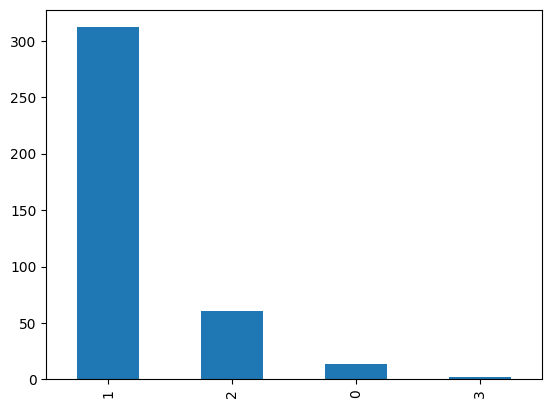
​    


```python
test = train
x = train.drop('totalVotes', axis=1) 
y = train['totalVotes']

test['time_diff_days'] += 365
test = test.drop('totalVotes', axis =1)


dt_reg = DecisionTreeRegressor(random_state=42)
dt_reg.fit(x,y)
y_pred = dt_reg.predict(test)
test['totalVotes'] = y_pred
test['tova']
```


<div>
<style scoped>
    .dataframe tbody tr th:only-of-type {
        vertical-align: middle;
    }


    .dataframe tbody tr th {
        vertical-align: top;
    }
    
    .dataframe thead th {
        text-align: right;
    }

</style>

<table border="1" class="dataframe">
  <thead>
    <tr style="text-align: right;">
      <th></th>
      <th>datasetSize</th>
      <th>usabilityRating</th>
      <th>medal</th>
      <th>time_diff_days</th>
      <th>PCA1</th>
      <th>PCA2</th>
      <th>PCA3</th>
      <th>PCA4</th>
      <th>PCA5</th>
      <th>creatorWeight</th>
      <th>totalVotes</th>
    </tr>
  </thead>
  <tbody>
    <tr>
      <th>41</th>
      <td>-0.102039</td>
      <td>0.941176</td>
      <td>1</td>
      <td>1179.0</td>
      <td>-0.079437</td>
      <td>-0.010163</td>
      <td>-0.235343</td>
      <td>-0.045416</td>
      <td>-0.058157</td>
      <td>2.502198</td>
      <td>47.0</td>
    </tr>
    <tr>
      <th>323</th>
      <td>-0.102039</td>
      <td>0.941176</td>
      <td>2</td>
      <td>1119.0</td>
      <td>0.188057</td>
      <td>0.753615</td>
      <td>0.257330</td>
      <td>-0.292760</td>
      <td>0.114502</td>
      <td>-0.449940</td>
      <td>47.0</td>
    </tr>
    <tr>
      <th>132</th>
      <td>-0.102018</td>
      <td>1.000000</td>
      <td>1</td>
      <td>1163.0</td>
      <td>-0.164859</td>
      <td>0.085290</td>
      <td>-0.306192</td>
      <td>0.043682</td>
      <td>-0.431574</td>
      <td>-0.587962</td>
      <td>42.0</td>
    </tr>
    <tr>
      <th>244</th>
      <td>-0.099673</td>
      <td>1.000000</td>
      <td>1</td>
      <td>1148.0</td>
      <td>-0.312926</td>
      <td>0.114904</td>
      <td>-0.209190</td>
      <td>-0.044327</td>
      <td>-1.048671</td>
      <td>-0.419269</td>
      <td>32.0</td>
    </tr>
    <tr>
      <th>38</th>
      <td>-0.101945</td>
      <td>0.941176</td>
      <td>0</td>
      <td>1142.0</td>
      <td>1.094935</td>
      <td>-0.706830</td>
      <td>-0.038796</td>
      <td>-0.368443</td>
      <td>-0.084584</td>
      <td>2.502198</td>
      <td>47.0</td>
    </tr>
    <tr>
      <th>...</th>
      <td>...</td>
      <td>...</td>
      <td>...</td>
      <td>...</td>
      <td>...</td>
      <td>...</td>
      <td>...</td>
      <td>...</td>
      <td>...</td>
      <td>...</td>
      <td>...</td>
    </tr>
    <tr>
      <th>368</th>
      <td>3.208777</td>
      <td>0.812500</td>
      <td>2</td>
      <td>1166.0</td>
      <td>-0.554117</td>
      <td>-0.205875</td>
      <td>0.271080</td>
      <td>-0.498847</td>
      <td>0.022007</td>
      <td>-0.449940</td>
      <td>47.0</td>
    </tr>
    <tr>
      <th>219</th>
      <td>-0.098527</td>
      <td>0.941176</td>
      <td>1</td>
      <td>1139.0</td>
      <td>-0.129216</td>
      <td>0.064322</td>
      <td>-0.327955</td>
      <td>0.032830</td>
      <td>-0.295229</td>
      <td>-0.587962</td>
      <td>34.0</td>
    </tr>
    <tr>
      <th>165</th>
      <td>-0.099721</td>
      <td>1.000000</td>
      <td>1</td>
      <td>1176.0</td>
      <td>-0.033508</td>
      <td>0.600691</td>
      <td>0.171834</td>
      <td>-0.253795</td>
      <td>-0.592117</td>
      <td>-0.503616</td>
      <td>28.0</td>
    </tr>
    <tr>
      <th>13</th>
      <td>-0.102019</td>
      <td>1.000000</td>
      <td>2</td>
      <td>1181.0</td>
      <td>0.027297</td>
      <td>0.179917</td>
      <td>-0.098193</td>
      <td>0.518960</td>
      <td>0.003691</td>
      <td>2.502198</td>
      <td>159.0</td>
    </tr>
    <tr>
      <th>184</th>
      <td>-0.102038</td>
      <td>0.588235</td>
      <td>1</td>
      <td>1158.0</td>
      <td>0.256058</td>
      <td>0.718463</td>
      <td>0.046207</td>
      <td>0.586722</td>
      <td>-0.209381</td>
      <td>0.247838</td>
      <td>26.0</td>
    </tr>
  </tbody>
</table>
<p>389 rows × 11 columns</p>

</div>


```python
test['totalVotes'].describe()
```


    count    389.000000
    mean      47.532134
    std       38.285917
    min       22.000000
    25%       29.000000
    50%       36.000000
    75%       47.000000
    max      447.000000
    Name: totalVotes, dtype: float64


```python

```


## 끝으로

UKSnotes를 찾아주셔서 감사합니다.


